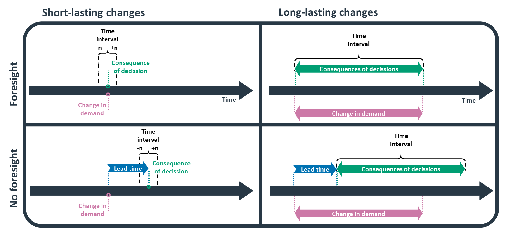
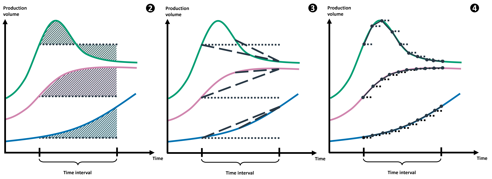

Consequential modelling
=======================

The premise module allows users to import and adjust
the consequential system model of the ecoinvent database
v3.8 and 3.9, with a focus on electricity and fuel markets.
This work is based on a publication with available
at https://doi.org/10.1016/j.rser.2023.113830

If you use this module, please cite the publication:

*Ben Maes, Romain Sacchi, Bernhard Steubing, Massimo Pizzol, Amaryllis Audenaert, Bart Craeye, Matthias Buyle,*
**Prospective consequential life cycle assessment: Identifying the future marginal suppliers using integrated assessment models,**
Renewable and Sustainable Energy Reviews,
Volume 188, 2023, doi: 10.1016/j.rser.2023.113830

Currently, the identification of marginal supplying
technologies is limited
to the electricity and fuel sectors.

Some technologies are excluded from the marginal markets
due to constraints on their feedstock availability.
This typically applies to waste-to-energy (e.g., waste-based CHP)
or waste-to-fuel (e.g., residue-based biofuel) plants.
For steel markets, only the BF-BOF route is considered.

Some imported inventories cannot be
directly linked to the ecoinvent consequential database.
To address this, a mapping file is provided under
https://github.com/polca/premise/blob/master/premise/data/consequential/blacklist.yaml
which proposes alternative candidates to link to the ecoinvent consequential database.

How does it work?
-----------------

From the user viewpoint, the process is as follows:

* prepare a set of parameters that condition the identification of the marginal electricity suppliers
* supply the parameters to `NewDatabase()`
* point to the your local ecoinvent consequential database

The parameters used to identify marginal suppliers that make up
a market are:

* range time (years, default = 2)
* duration (years, default = 0)
* foresight (True or False, default = False)
* lead time (True or False, default = False)
* capital replacement rate (True or False, default = False)
* measurement (0 to 4, default = 0)
* weighted slope start (default = 0.75)
* weighted slope end (default = 1.00)

    Techniques to determine the time interval of a study considering the supplier’s foresight and the duration of the change.

Range time
^^^^^^^^^^

Integer. Years. Used for single occurrences or short-lasting changes in demand (less than 3 years).
Since the duration of the change is too short to measure a trend, 
the trend is instead measured around the point where the additional
capital will be installed. A range of n years before and after the point
is taken as the time interval. Note that if set to a value other than 0,
the duration argument must be set to 0. 
A default range of 2 years is chosen. 
This value closely mirrors the recommended time interval in ecoinvent’s consequential database, which is 3-4 years.

Duration
^^^^^^^^

Integer. Years. Used for long-lasting changes in demand (3 years or more).
Duration over which the change in demand occurs should be measured.
Note that if set to a value other than 0, the range time argument must be set to 0.

Foresight
^^^^^^^^^

True or False. In the myopic approach (False), also called a recursive dynamic
approach, the agents have no foresight on relevant parameters (e.g., energy demand,
policy changes and prices) and will only act based on the information they can observe.
In this case, the suppliers can answer to a change in demand only after it has occurred.
In the perfect foresight approach, the future (within the studied time period) is fully
known to all agents. In this case, the decision to invest can be made ahead of the change
in demand. For suppliers with no foresight, capital will show up a lead time later.

Lead time
^^^^^^^^^

True or False. If False, the market average lead time is taken for all technologies.
If True, technology-specific lead times are used.
If Range and Duration are both set to False, then the lead time is taken as the
time interval (just as with ecoinvent v.3.4).

If you wish to modify the default lead time values used for the different
technologies, you can do so by modifying the file:

https://github.com/polca/premise/blob/master/premise/data/consequential/leadtimes.yaml

Capital replacement rate
^^^^^^^^^^^^^^^^^^^^^^^^

True or False. If False, a horizontal baseline is used.
If True, the capital replacement rate is used as baseline.
The capital replacement rate is equal to -1 divided by
the lifetime (in years) of the technology. It represents the rate
at which the capital stock depreciates and must be replaced.
Hence, it will be subtracted from the "growth" rate of the technology,
to distinguish between the growth rate due to the change in demand
and the growth rate due to the replacement of capital stock.

.. figure:: Baseline.png

    (left). The capital replacement rate is not considered. (right) The capital replacement rate is subtracted from the growth rate to distinguish between the growth rate due to the change in demand and the growth rate due to the replacement of capital stock.

If you wish to modify the default lifetime values used for the different
technologies, you can do so by modifying the file:

https://github.com/polca/premise/blob/master/premise/data/consequential/lifetimes.yaml

Measurement method
^^^^^^^^^^^^^^^^^^

Methods 0 and 1 are used if the production volume follows an almost linear pattern.
Methods 2, 3 and 4 are used if the production volume follows a non-linear pattern.
Short-lasting changes tend to follow a linear pattern, whereas long-lasting changes often do not.

* 0 = slope: Default method, also used by ecoinvent.
* 1 = linear regression: Outliers have less of an effect on the results than with Method 0.
* 2 = area under the curve: Used if there is an emphasis on the consequences in the short term, e.g., if knowing “when” to best introduce the change is important.
* 3 = weighted slope: Curvature is determined using two slopes. First, the same slope as used in Method 0. Second, a shorter slope, which by default is placed at the end of the time interval. The ratio of the short and long slope is used to adjust the calculated values of Method 0. By placing the shorter slope at the end, exponential growth curves are favored. Used if there is an emphasis on the consequences in the long term, e.g., if the focus of the study is on reaching net zero emissions by 2050.
* 4 = time interval is split in individual years and measured: The more balanced approach out of the three non-linear methods (i.e., 2, 3, and 4). Short-, mid- and long-term developments are equally important.

    Non-linear methods (2, 3 and 4) are used if the production volume follows a non-linear pattern. Short-lasting changes tend to follow a linear pattern, whereas long-lasting changes often do not.

Weighted slope start
^^^^^^^^^^^^^^^^^^^^

Weighted slope start is needed for measurement method 3.
The number indicates where the short slope starts
and is given as the fraction of the total time interval.

Weighted slope end
^^^^^^^^^^^^^^^^^^^

Weighted slope end is needed for measurement method 3.
The number indicates where the short slope ends
and is given as the fraction of the total time interval.

Database creation
^^^^^^^^^^^^^^^^^

The user needs to specify the arguments presented above.
If not, the following default arguments value are used:

.. code-block:: python

    args = {
        "range time":2,
        "duration":0,
        "foresight":False,
        "lead time":False,
        "capital replacement rate":False,
        "measurement": 0,
        "weighted slope start": 0.75,
        "weighted slope end": 1.00
    }

.. code-block:: python

    ndb = NewDatabase(
        scenarios = scenarios,
        source_db="ecoinvent 3.8 consequential",
        source_version="3.8",
        key='xxxxxxxxx',
        system_model="consequential",
        system_args=args
    )

    ndb.update("electricity")

    ndb.write_db_to_brightway()
