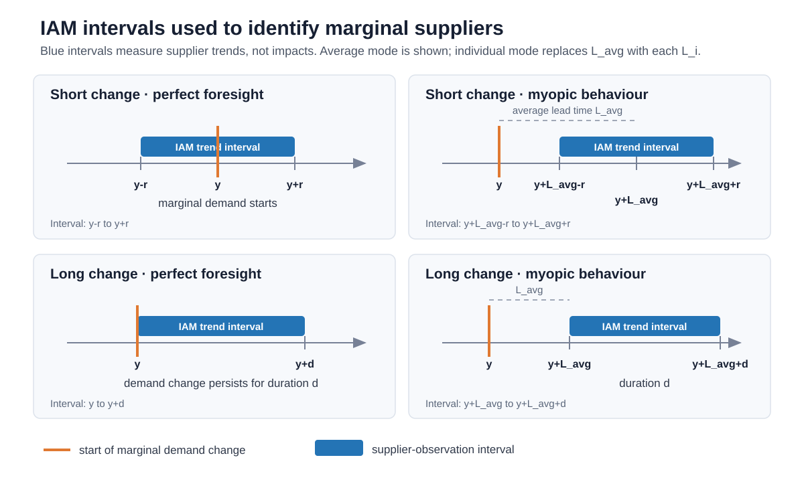
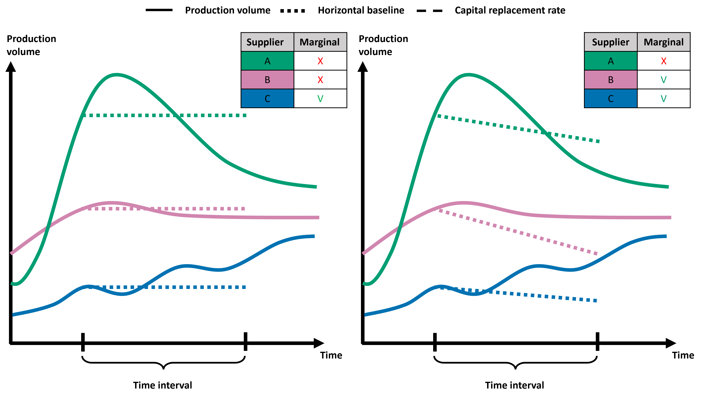
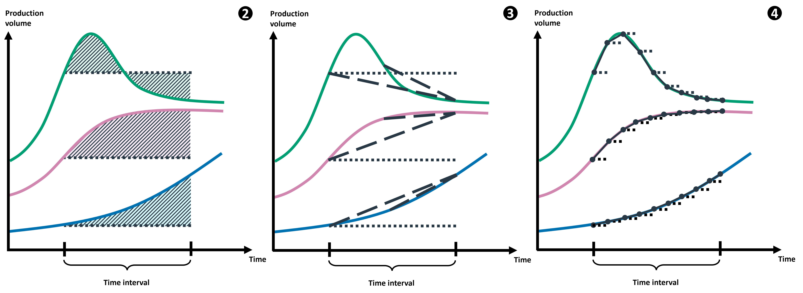

Consequential modelling
=======================

Premise can import and transform the consequential system model of ecoinvent
versions 3.8 to 3.12. It uses production trajectories from an integrated
assessment model (IAM) to identify the suppliers that are likely to respond to
a marginal change in demand. The method is described by `Maes et al. (2023)
<https://doi.org/10.1016/j.rser.2023.113830>`_.

If you use this module, please cite:

    Maes, B., Sacchi, R., Steubing, B., Pizzol, M., Audenaert, A., Craeye, B.,
    and Buyle, M. (2023). *Prospective consequential life cycle assessment:
    Identifying the future marginal suppliers using integrated assessment
    models*. Renewable and Sustainable Energy Reviews, 188, 113830.
    https://doi.org/10.1016/j.rser.2023.113830

What the consequential parameters describe
--------------------------------------------

The ``system_args`` parameters do not describe when environmental impacts
occur. They determine the IAM time interval Premise uses to identify the
background suppliers that respond to a marginal change in demand.

``year`` is both the scenario year of the generated database and the year in
which the modelled change in demand begins. ``duration`` describes how long
that change persists forward from ``year``. ``range time`` defines an
observation window for a short-lived change.

It is useful to distinguish three clocks:

.. list-table::
   :header-rows: 1
   :widths: 24 76

   * - Clock
     - Meaning
   * - Database year
     - The year of the prospective background database and the initial year of
       the marginal demand change.
   * - Demand-change period
     - The period for which the additional or reduced demand persists.
   * - Supplier-observation interval
     - The IAM years over which production trends are measured to identify the
       marginal suppliers.

.. important::

   ``duration`` is not automatically the lifetime of the assessed product,
   and it does not integrate emissions or impacts over several years. Lead
   time does not move the foreground activity or its emissions to another
   year. Premise produces a static database containing one marginal supplier
   mix for each transformed market.

Premise builds marginal mixes for commodities for which the selected IAM
scenario provides production volumes. A technology's contribution is derived
from its production trend over the selected supplier-observation interval.

Choosing the demand-change period
---------------------------------

First define the marginal demand change represented by the study:

* For a single occurrence or a change lasting less than three years, use
  ``duration=0`` and a non-zero ``range time``. The default ``range time=2``
  measures the trend over two years before and two years after the expected
  installation of additional capacity.
* For a change lasting three years or more, use ``range time=0`` and set
  ``duration`` to the number of years for which the change persists.
* Do not set both ``range time`` and ``duration`` to non-zero values. This
  combination is unsupported.
* For a permanent or indefinite change, select and justify a finite duration
  that fits the goal and scope. An infinite IAM trend cannot be measured.

``range time`` is a half-width, not a total interval length. For example,
``range time=4`` selects four years before and four years after the centre of
the interval, giving an eight-year difference between its endpoints.

How the supplier-observation interval is calculated
---------------------------------------------------

Let ``y`` be the database year and start of the demand change, ``r`` the
``range time``, ``d`` the ``duration``, and ``L_avg`` the production-weighted
average lead time of suppliers in the market.

.. list-table:: Supplier-observation intervals
   :header-rows: 1
   :widths: 24 38 38

   * - Demand change
     - Perfect foresight
     - Myopic behaviour
   * - Short: ``range time=r``
     - ``y-r`` to ``y+r``
     - ``y+L_avg-r`` to ``y+L_avg+r``
   * - Long: ``duration=d``
     - ``y`` to ``y+d``
     - ``y+L_avg`` to ``y+L_avg+d``
   * - Both set to zero
     - ``y-L_avg`` to ``y``
     - ``y`` to ``y+L_avg``

The endpoints describe an elapsed interval. Annual IAM values, including both
endpoints, may be used during the calculation. If a calculated endpoint falls
outside the available IAM time series, Premise uses the nearest available IAM
year. This shortens or shifts the effective interval, so inspect the summary
printed during database generation.

   IAM intervals used to identify marginal suppliers. The blue bars show the
   interval over which supplier production trends are measured; they do not
   show when environmental impacts occur.

Foresight and lead time
-----------------------

With myopic behaviour (``foresight=False``, the default), suppliers react only
after the change in demand becomes observable. Premise therefore shifts the
supplier-observation interval forward by the market's average lead time.

With perfect foresight (``foresight=True``), suppliers anticipate the change.
The interval is not shifted forward: a short interval is centred on ``year``,
and a long interval begins at ``year``.

Premise calculates ``L_avg`` from technology-specific lead times and the
technologies' production shares in the market. The lead-time data are stored in
`leadtimes.yaml
<https://github.com/polca/premise/blob/master/premise/data/consequential/leadtimes.yaml>`_.

.. warning::

   The ``"lead time"`` argument remains part of the API. In the current
   implementation, setting it to ``True`` does not produce technology-specific
   observation intervals for ordinary short- or long-lasting changes; both
   settings use ``L_avg``. Keep the default ``False`` unless reproducing a
   configuration that explicitly used this argument.

Lead time describes the response of background suppliers. It is not the time
between a foreground investment decision and use of the foreground product,
and it does not change the year represented by the generated database.

Worked examples
---------------

.. list-table::
   :header-rows: 1
   :widths: 42 12 18 14 14

   * - Modelled marginal demand change
     - ``year``
     - ``range time``
     - ``duration``
     - Change type
   * - One additional bicycle is demanded in 2050
     - 2050
     - 2
     - 0
     - Short
   * - Additional bicycle production starts in 2046 and lasts four years
     - 2046
     - 0
     - 4
     - Long
   * - A factory starts production in 2050 and adds demand for twenty years
     - 2050
     - 0
     - 20
     - Long

The second example starts in 2046: ``duration=4`` looks forward from that year.
Using ``year=2050`` and ``range time=4`` would instead describe a short change
centred on 2050, which is a different question.

.. note::

   A single set of ``system_args`` cannot schedule construction of a foreground
   factory in 2026 and its operation in 2050. That question requires a
   time-specific foreground model, separate databases for the relevant years,
   or a dynamic LCA method. The consequential parameters only determine how
   Premise selects marginal suppliers in the background markets it transforms.

Capital replacement
-------------------

When ``capital replacement rate=True`` (the default), Premise accounts for the
replacement of depreciated production capacity. For a supplier with production
``P`` and lifetime ``L``, the replacement baseline is ``-P/L``. The baseline is
subtracted from the observed production slope.

For example, a technology with stable production has a raw slope of zero. Its
adjusted indicator is ``0 - (-P/L) = P/L``. It may therefore be part of the
marginal mix because investment is needed to replace retiring capacity even
though its total production does not grow.

Capital replacement affects supplier eligibility and marginal shares. It is
not a lead time and does not add the embodied environmental burden of replacing
equipment to the foreground model.

   Left: a horizontal baseline. Right: the capital replacement baseline is
   subtracted from the production trend.

Technology lifetimes are stored in `lifetimes.yaml
<https://github.com/polca/premise/blob/master/premise/data/consequential/lifetimes.yaml>`_.

Measuring production trends
---------------------------

The ``measurement`` argument controls how production changes are quantified
within the supplier-observation interval:

* ``0`` -- endpoint slope. This is the default and is also used by ecoinvent.
  It is generally suitable for short intervals and approximately linear trends.
* ``1`` -- linear regression. It reduces the influence of individual annual
  values compared with an endpoint slope.
* ``2`` -- area under the curve. It gives more emphasis to developments early
  in the interval and can be useful when near-term consequences matter most.
* ``3`` -- weighted slope. It adjusts the full-interval slope using a shorter
  slope defined by ``weighted slope start`` and ``weighted slope end``. With
  the defaults, this shorter slope covers the last quarter of the interval and
  emphasizes developments near its end.
* ``4`` -- annual measurement. It splits the interval into individual years
  and gives short-, medium-, and long-term developments equal importance.

Methods 2 to 4 are intended for non-linear production trajectories, which are
more likely over long intervals. The choice of interval can have a larger
effect than the choice of measurement method, so consequential studies should
test plausible durations and measurement methods when these choices are
material to the conclusions.

   Comparison of methods 2, 3, and 4 for non-linear production trajectories.

Configuration reference
-----------------------

The supported ``system_args`` and their implementation defaults are:

.. list-table::
   :header-rows: 1
   :widths: 31 15 14 40

   * - Argument
     - Type
     - Default
     - Purpose
   * - ``range time``
     - integer years
     - ``2``
     - Half-width of the interval for a short demand change.
   * - ``duration``
     - integer years
     - ``0``
     - Persistence of a long demand change, forward from ``year``.
   * - ``foresight``
     - boolean
     - ``False``
     - Selects myopic or perfect-foresight timing.
   * - ``lead time``
     - boolean
     - ``False``
     - Does not enable technology-specific intervals in the current
       implementation; see the limitation above.
   * - ``capital replacement rate``
     - boolean
     - ``True``
     - Uses technology replacement requirements as the baseline.
   * - ``measurement``
     - integer, 0--4
     - ``0``
     - Selects the production-trend measurement method.
   * - ``weighted slope start``
     - fraction
     - ``0.75``
     - Start of the short slope used by method 3.
   * - ``weighted slope end``
     - fraction
     - ``1.00``
     - End of the short slope used by method 3.

Pass the arguments explicitly so that the modelling choices remain visible and
reproducible:

.. code-block:: python

    from premise import NewDatabase

    system_args = {
        "range time": 2,
        "duration": 0,
        "foresight": False,
        "lead time": False,
        "capital replacement rate": True,
        "measurement": 0,
        "weighted slope start": 0.75,
        "weighted slope end": 1.00,
    }

    ndb = NewDatabase(
        scenarios=scenarios,
        source_db="ecoinvent 3.12 consequential",
        source_version="3.12",
        key="xxxxxxxxx",
        system_model="consequential",
        system_args=system_args,
    )

    ndb.update("electricity")
    ndb.write_db_to_brightway()

During transformation, Premise prints a summary for each marginal market. In
particular, check ``Start`` and ``End`` to verify the effective IAM interval,
and inspect ``Foresight``, ``Duration``, ``Cap repl.``, and ``Vol ch.``. This is
especially important when an interval approaches the first or last IAM year.

Scope and limitations
---------------------

* The method assumes a small marginal change. A project large enough to alter
  market structure or the IAM pathway itself requires additional scenario
  modelling.
* One ``system_args`` dictionary is applied to the transformed consequential
  markets. Different demand changes may justify different time intervals and,
  consequently, separate database builds.
* IAM production values are interpolated to annual resolution. Requested
  interval endpoints outside the available IAM years are replaced with the
  nearest available year.
* The generated database is static. The supplier-observation interval does not
  create temporally distributed exchanges or a dynamic impact assessment.
* A long or permanent change still requires a finite, documented duration.

Some technologies are excluded from marginal markets because their feedstock
availability constrains their response. This typically applies to
waste-to-energy and waste-to-fuel technologies. Secondary steel is excluded
from marginal steel mixes. The exclusions are defined in the consequential
data files shipped with Premise.

Some imported inventories cannot be linked directly to the ecoinvent
consequential database. `blacklist.yaml
<https://github.com/polca/premise/blob/master/premise/data/consequential/blacklist.yaml>`_
provides alternative linking candidates.
