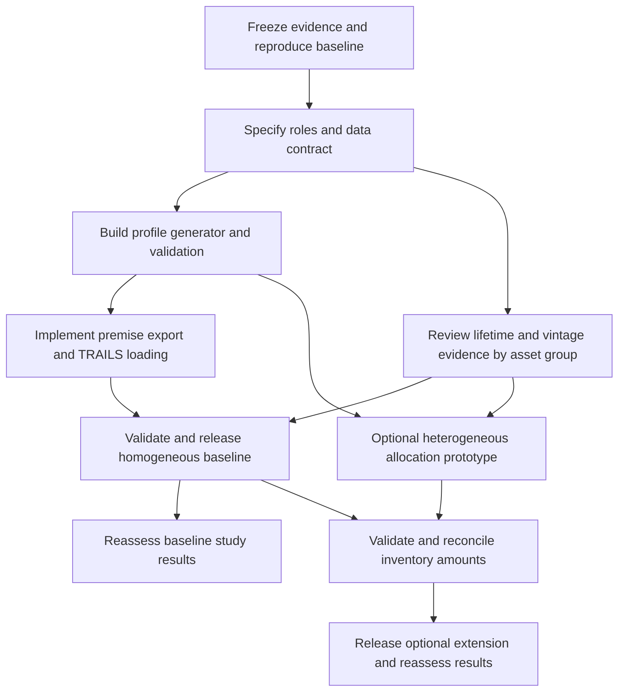

# Stock-asset temporal modelling: strategy and implementation plan

Status: proposed design; implementation has not started.
Reviewed: 9 October 2026.
Planning branch: `plan/stock-asset-temporal-distributions`, based on `trals`.

## Purpose

Replace ambiguous stock-age parameters with reproducible temporal profiles for
assets supplying services. Separate installation history, survival, utilisation,
production attribution, and lifecycle events. Apply the method to all stock
assets, with evidence and fallback assumptions appropriate to each group.

The immediate problem is that the existing table, review plots, and TRAILS
runtime do not always describe the same distributions. The broader problem is
that a supplier's assumed age curve cannot, by itself, represent the vintage
composition and production attribution of every service consuming that supplier.

This plan covers changes in both `polca/premise` and `romainsacchi/trails`.
The planning documents live in premise because the source parameter table and
review workflow live here. TRAILS implementation will need a coordinated branch
and release. This documentation branch changes neither inventories nor runtime
behaviour.

## Read the documents in this order

| Document | Purpose |
|---|---|
| [Strategy](strategy.md) | Modelling definitions, equations, scope, and decisions |
| [Data contract](data-contract.md) | Source records, exchange roles, generated profiles, and package compatibility |
| [Asset review](asset-review.md) | Evidence hierarchy and review instructions for all 23 existing groups |
| [Data search campaign](data-search-campaign.md) | Available evidence, difficulty by asset group, acquisition priorities, effort and stopping rules |
| [Source register](data-source-register.md) | 28 external source families, access status, file checks and limitations |
| [IAM scenario assessment](iam-scenario-assessment.md) | Audit of actual local IMAGE/REMIND and other exports; native cohort and reconstruction routes |
| [Implementation plan](implementation-plan.md) | Work packages, dependencies, repository ownership, and completion criteria |
| [Validation and rollout](validation-and-rollout.md) | Analytical tests, integration checks, scientific comparison, and release stages |
| [Evidence and references](evidence-and-references.md) | Audited revisions, reproduced findings, source links, and limitations |

## Recommended decisions

1. Distinguish an existing asset supplying a service from a new asset or
   replacement component entering another process. Timing is an exchange role,
   not an intrinsic property of every occurrence of a durable supplier.
2. Prefer observed installation cohorts. Otherwise reconstruct cohorts from
   additions and survival. Use explicitly labelled stationary assumptions when
   historical evidence is absent.
3. Keep mean stock age, lifetime, construction duration, and remaining lifetime
   separate. Do not rescale an age parameter automatically with lifetime.
4. Generate explicit annual offsets and weights, using existing type 6 transport
   fields, with additional versioned provenance and compatibility metadata.
5. Use a homogeneous baseline where equal utilisation and equal lifetime service
   make stock shares and manufacturing shares identical. Check those assumptions
   per group. Preserve existing exchange totals while auditing their amortisation;
   make heterogeneous lifetime-service allocation an explicit extension.
6. Preserve cohort/lifetime identity for lifecycle events. Independent marginal
   profiles must not create impossible manufacture/retirement combinations.
7. Validate generated profiles with the actual exporter, loader, and router.
   Review plots must display those same generated weights.

## Baseline and optional extension

| Level | What it provides | What it does not establish |
|---|---|---|
| Homogeneous baseline correction | Explicit stock profiles; correct roles and runtime; equal lifetime-service/utilisation assumptions checked; inventory totals and lifecycle timing audited | Heterogeneous individual-lifetime allocation where those assumptions fail |
| Heterogeneous service extension | Population-specific utilisation/lifetime allocation, reconciled amounts, and linked lifecycle histories | Universal empirical coverage; some groups still require declared priors |

Stock and production timing need no extra reweighting when equal lifetime service
and equal current utilisation actually hold. A shared lifetime probability law
does not imply identical realised lifetime service. Where evidence supports only
average amortisation, name that approximation. Changing the numerical kernel
alone does not validate the stock history or the allocation assumptions.

## Implementation sequence

## Baseline and current progress

The audit uses premise `82f5c5d063473fd3984e818d11a54962989b1130` and
TRAILS `b7d1bb78f0388ba3916270e6654353e01624807e`. There are 987
`stock_asset` rows: 317 lognormal and 670 triangular. These are CSV-row counts,
not unique suppliers or counts of exchanges matched in a built database.

- [x] Inspect the parameter table, review workflow, exporter, and runtime.
- [x] Reproduce representative passenger-car runtime weights.
- [x] Check the distinction between stock composition and service allocation.
- [x] Document the proposed strategy and staged implementation.
- [x] Inventory local lifetime evidence and screen external stock-data sources.
- [x] Audit 20 IMAGE/REMIND source files and screen 21 other IAM exports for
      stock-building variables; identify native REMIND cohort-export routes.
- [ ] Produce the complete per-row and per-exchange migration audit.
- [ ] Implement and validate the proposed data contract and generator.
- [ ] Review and migrate all stock-asset groups.
- [ ] Rebuild databases and quantify effects on study results.

The observations above are not evidence that affected published or manuscript
results have been recalculated. See the [validation plan](validation-and-rollout.md)
for the required comparisons.

The planning documents were checked for local links, reference definitions,
code-fence balance, JSON example validity, coverage of all 23 workbook groups,
and agreement with the 987-row baseline. The Python reproduction examples and
both worked lifetime-allocation examples were executed successfully. No runtime
implementation changes or full LCA recalculations are part of this branch.

The data-search revision adds hashed source inventories and four external
file/codebook spot checks. These establish availability, not approved stock
profiles. REMIND is the strongest local scenario source: stocks, sales, capacity
additions and energy-technology lifetimes are present, while native transport
cohorts and exact reporting versions still need acquisition. The local IMAGE
exports require expansion. See the IAM assessment for the scope of these claims.

## Scope boundaries

Biomass-growth and long-term-emission profiles retain their existing meanings.
They are regression controls, not targets for stock-age migration. Foreground
inventories with explicitly specified construction or replacement schedules
remain authoritative within their documented scope.

The design is for attribution of service to assets. A prospective scenario does
not, by itself, turn this into a consequential investment model. Marginal
capacity additions, substitution, recycling allocation, and technology choice
remain governed by the study and database system model.

## Completion definition

Every stock row must have a reviewed disposition, every matched exchange a
documented role, and every generated profile a reproducible source or declared
fallback. The consumer must evaluate the exported profile as reviewed. The
heterogeneous extension additionally requires conservation of population-level
allocated asset production and explained changes to inventory totals. Both need
coherent lifecycle events and quantified uncertainty. The homogeneous correction
can be completed and released without implementing the optional extension.
