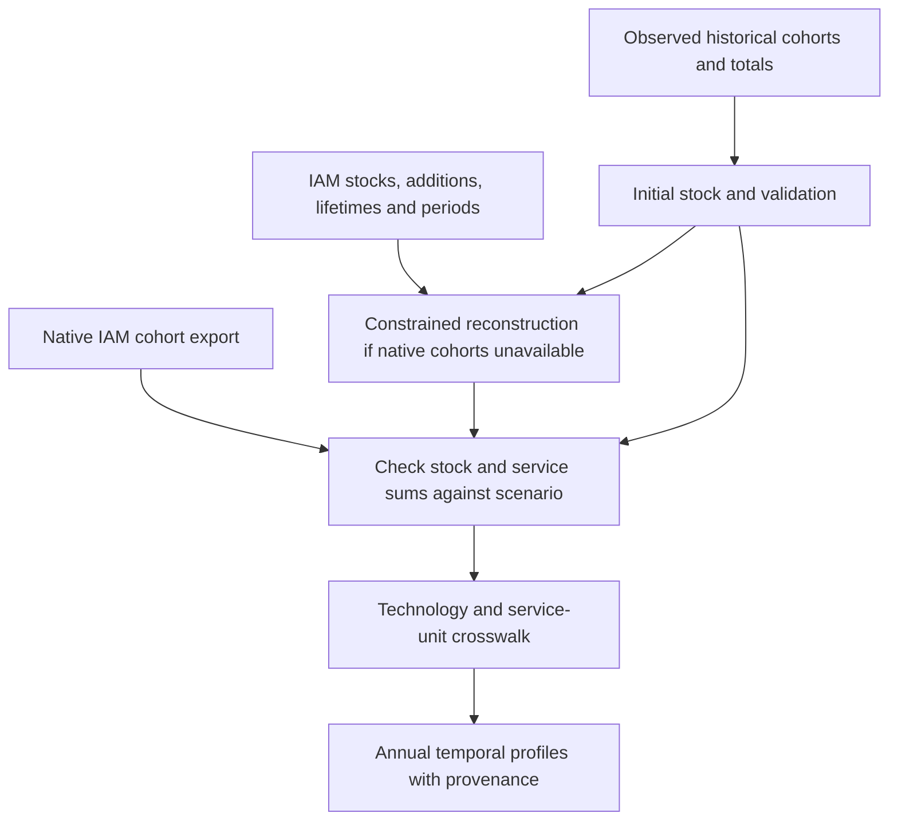

# Using the actual IAM scenarios to build stock vintages

Status: local export and upstream-code audit, 9 October 2026.
No IAM model was run and no reconstructed profile is approved by this document.

## Finding and recommended route

**Use REMIND 3.5.2 as a first implementation pilot.** Its local exports contain
both physical transport stocks/sales and energy-conversion capacity/additions,
with technology lifetimes for the latter. Better still, the upstream transport
code already constructs cohorts internally. Obtain those native cohorts where
possible, and use the MIF series as reconciliation targets.

The eight local IMAGE 3.4 workbooks do not contain capacity, stock, sales,
lifetime, retirement or cohort variables. They describe energy, services,
production and related quantities. This is a limitation of these exports, not
proof that IMAGE lacks stock dynamics. Request an expanded export before trying
to infer vintages from energy production alone.

Combine IAM information with observed initial stocks and external validation.
Model-generated historical values, including their pre-base-year assumptions,
must be labelled as model results rather than empirical fleet observations.

## Files inspected

The local source root is
`/Users/romain/Library/CloudStorage/Dropbox/Notebooks/IAM-ecoinvent`.

| Collection | Scope inspected | Relevant result |
|---|---|---|
| `image 3.4` | All 8 top-level XLSX scenarios; 219,947 rows in total; 26 regions plus World; 2005–2100 | 1,026 variable/unit pairs in seven files and 1,027 in one. No physical-stock/addition/lifetime/cohort families found; 47 energy-service pairs per file |
| `remind 3.5.2` | All 12 top-level MIF files; 1,272,366 rows in total; eight standard-region and four EU21 scenarios; 2005–2150 | Rich stock-building inputs described below; no explicitly named vintage/cohort/retirement series |
| Other local exports | 4 GCAM files, 4 TIAM-UCL workbooks, 2 WITCH CSVs and 11 MESSAGE CSVs | Variable-name/unit screening found no usable physical stock/additions/lifetime/cohort families. These are also restricted exports, not evidence about full model capabilities |
| Filtered REMIND example | `allocated/REMIND_generic_SSP2-NPi2025_feedstock_filtered.csv` and the corresponding `_filtered_filtered.csv` | Both have 2,886 variables, retain Sales/New Cap/Tech families, but omit Stock and Cap families |
| Filtered IMAGE example | `processed/IMAGE 3.4_SSP2_M_CP_filtered.csv` | 1,080 variables; no stock-building families introduced by processing |

The [file inventory](iam-file-inventory.csv) records hashes, model/scenario
labels, years, regions and family counts for the 20 principal files. The
[other-file inventory](other-iam-file-inventory.csv) records the 21 additional
exports. The [variable inventory](iam-variable-inventory.csv) records the
screened principal families and coverage across files. Counts include hierarchy
totals and overlapping categories; they are not counts of distinct technologies.

Screen variable names together with units: the TIAM-UCL candidate
`Secondary Energy|Electricity|Biomass existing capacity|w/o CCS` is expressed in
PJ/year. It describes energy output, despite containing the word capacity.

REMIND MIF rows identify the model simply as `REMIND`; `3.5.2` comes from the
folder name. Obtain run identifiers, configuration and reporting-package versions
before claiming exact correspondence with a particular source-code revision.
The standard files contain 12 regions plus World. EU21 files contain 25 region
labels including aggregates such as EUR and EU27; these cannot all be summed.

No `fulldata.gdx`, EDGE-T folder, or matching fleet/vintage RDS/CSV filename was
found by a targeted filename search under this source root. This does not rule
out another archive or storage location. Do not claim native cohorts are locally
available yet. Older REMIND 3.5 and REMIND–MAgPIE directories were noticed but not
audited numerically; they are a later comparison if needed.

## REMIND variables actually present

Every one of the 12 principal REMIND exports contains these families:

| Family | Variable/unit pairs per file | Meaning for the revision |
|---|---:|---|
| `Cap` | 76, including 39 electricity entries | Installed/operating capacity targets, usually GW; some non-electric capacities have other physical units |
| `New Cap` | 72, including 35 electricity entries | New capacity rates, generally GW/year; potential cohort inflows after resolving reporting periods |
| `Cumulative Cap` | 72 | Integral of reported additions; useful diagnostic, not surviving stock |
| `Stock` for transport | 123: 83 passenger and 40 freight | Million vehicles by class/technology, including aggregation levels |
| `Sales` for transport | 123 with matching category names | Reported unit is `million veh`, without `/yr`; temporal meaning must be verified from the run's reporting pipeline |
| `Tech` ending in `Lifetime` | 53, including 24 electricity entries | Years; technology lifetime inputs for energy-conversion processes |
| `ES` | 424 | Energy-service quantities; selected car rows use billion passenger-km/year, freight rows tonne-km/year |

The counts above use exact prefixes followed by `|`. They exclude an additional
hydrogen input-capacity series labelled `Cap (GWel)` and its corresponding new
and cumulative forms. There are also three `Idle Cap` and two `Total Cap` series,
plus selected capacity-factor outputs. They deserve explicit mappings, not a
generic rule accepting every variable containing the word capacity.

Examples, preserving the exact exported names:

```text
Cap|Electricity|Solar|+|PV                         [GW]
New Cap|Electricity|Solar|+|PV                     [GW/yr]
Cumulative Cap|Electricity|Solar|+|PV              [GW]
Tech|Electricity|Solar|PV|Lifetime                 [years]

Stock|Transport|Pass|Road|LDV|Four Wheelers|Medium|Compact Car|BEV
Sales|Transport|Pass|Road|LDV|Four Wheelers|Medium|Compact Car|BEV
ES|Transport|Pass|Road|LDV|Four Wheelers|Medium|Compact Car|BEV

Stock|Transport|Freight|Road|Heavy|Truck(40t)|Liquids
Sales|Transport|Freight|Road|Heavy|Truck(40t)|Liquids
```

There is **no transport lifetime series** in the screened MIFs. Do not use an
electricity technology lifetime as a vehicle lifetime or infer lifetime as
stock/sales in a growing fleet. Some detailed stock/sales categories occur in
fewer regions: in the standard SSP2-NPi2025 example, only 87 of the 123 pairs
span all 13 labels. Absent rows must not automatically become zeros.

Premise's existing passenger-car mappings use matching `ES` leaf categories,
providing a useful starting point for the crosswalk. However, the inspected car
`ES` unit is passenger-km/year, despite the YAML header describing vehicle-km.
Respect the source row units and audit utilisation/load conversion through the
consumer before using the ratio of service to vehicle count.

## Why the native model outputs are preferable

### Vehicles: construction-year data already exist in the upstream calculation

The inspected [EDGE-Transport fleet routine][edge-fleet] returns
`fleetVehNumbersConstrYears` and `fleetESdemandConstrYears`, alongside total
fleet quantities and `reportEarlyRetirement`. These represent a direct route to
stock cohorts and their service contributions, before aggregation into reporting
variables. The routine uses annual mileage and load factors to convert service
to vehicles. Its initial fleet uses a constant-additions assumption before 2005;
it also contains an early-retirement adjustment. Those assumptions need external
validation and exact run-version confirmation.

The [vehicle depreciation routine][edge-depreciation] uses a fourth-power
age relationship and a `serviceLife` parameter. This is not the same
parameterisation as the energy-conversion lifetime rule below. Obtain the
actual class-specific parameter table, age indexing and early-retirement output;
do not replace both models with an arbitrary shared lognormal curve.

Preferred data request for the exact scenario run:

- Annual stock by observation year, original construction year, region, vehicle
  class and powertrain; annual service on the same dimensions.
- Gross sales, retirements/early retirement, annual mileage, load factors and
  service-life/depreciation inputs; used-vehicle transfers if represented.
- Initial-cohort construction assumptions, scenario identifiers, EDGE-Transport
  revision and output units; explanation of what exported `Sales` represents.

The public code establishes that this route exists in the inspected revision.
It does not establish that these exact intermediate objects were retained for
the local scenarios or that their runs used that revision.

### Power and other energy-conversion assets: reproduce the native capacity equation

REMIND v3.5.2 [source code][remind-input] defines a remaining-capacity kernel
whose continuous analogue has a fourth-power decline and maximum age 1.25 times
the reported average technical lifetime. The discrete code includes an age
offset. A reported 30-year lifetime therefore does not mean a hard retirement
at age 30. The [capacity equation][remind-equations] combines vintage additions,
period widths, that kernel and early-retirement factors. Preserve its indexing
when reconstructing the model stock.

Request the exact run's `vm_deltaCap`, `vm_cap`, `pm_omeg`, `pm_ts`,
`vm_capEarlyReti`, technology/grade mappings and historical initial-vintage
information, ideally through a compact cohort export from `fulldata.gdx`.
Some retirement variables represent removal from operating capacity; that need
not be physical dismantling at the same date. Keep operating-service attribution
and physical end-of-life timing distinct.

The inspected [remind2 capacity reporter][remind-report] transforms additions
from the model's period convention into centred reporting periods. Its
[conversion routine][remind-period] gives the five-year example of model additions
for 2016–2020 becoming a reported average around the 2020 reporting year. Thus a
MIF `New Cap` value cannot safely be interpreted as the entire build in its
labelled year. The reporter also integrates additions from a 2005 zero base to
form `Cumulative Cap`; this is not an initial surviving fleet.

These reporting sources are pinned below, but their version has not been linked
to the local run. Confirm that link and the period mapping before annualisation.

## Reconstruction strategy



1. **Select one region, scenario and leaf technology.** Begin with REMIND PV,
   compact BEV cars and 40-tonne liquid-fuel trucks. Include a policy scenario
   with declining fossil capacity to test early retirement, and one EU21 region
   to test overlapping regional aggregates.
2. **Prefer the native cohorts.** Validate their sums against reported stocks and
   services. Compare the model's initial vintage shape with observed stocks and
   retain a documented discrepancy, rather than silently substituting one for
   the other.
3. **If native outputs cannot be obtained, use a declared reconstruction.** For
   annual cohort stock, use initial survivors plus gross additions multiplied by
   survival, with transfers and early retirement where required. Constrain sums
   to the IAM's reported stock/capacity and service; retain the reconstruction
   assumptions and residuals.
4. **Resolve period semantics before annualisation.** Integrate rates over their
   represented years and preserve period totals. Distribute within a period
   according to a stated rule with timing sensitivity. Linear interpolation of
   stocks and additions independently need not conserve stock balance.
5. **Do not fit away inconsistencies.** If reported stock is lower than surviving
   cohorts, investigate retirement/idle capacity, technology reclassification,
   units and period alignment. A residual is not proof of an observed scrapping
   flow. Oldest-first removal is an optional assumption, not a source fact.
6. **Condition on the technology already used in premise.** Within-technology
   vintage weights must not apply the IAM technology mix a second time. Map
   vehicles to units, plant capacity to the inventory's plant size, and service
   to its reference product. Avoid applying vintage efficiency adjustments on
   top of an inventory that already uses a fleet-average efficiency.
7. **Keep temporal composition separate from amortisation.** Native service
   cohorts can improve service weights but do not, by themselves, give complete
   lifetime-service denominators for individual assets. The homogeneous/common
   amortisation baseline remains possible; heterogeneous allocation is separate.

For an annual physical stock `K`, the accounting check is:

```text
K[t] - K[t-1] = new_installations[t] + used_imports[t]
               - retirements[t] - used_exports[t]
```

Include reclassifications and other adjustments explicitly where the model
definition needs them. Net capacity change is not new construction. A snapshot
or an energy-production path alone cannot identify all terms in this balance.
For manufacturing timing, also record whether a cohort date means construction
start, equipment manufacture, commissioning or first service.

## IMAGE and the other restricted exports

The [IMAGE energy-conversion documentation][image-conversion] describes
investment and operation as distinct decisions. It motivates a richer export,
but the public pages consulted describe TIMER 3.2 and cannot establish exact
IMAGE 3.4 field names or run behaviour.

Request, for the existing IMAGE scenarios and native regions:

- Operating capacity and gross commissioning/retirement by technology and year;
  surviving capacity by original cohort where available.
- Cars, vans, buses and trucks by class/powertrain: stock, new sales, retirements,
  stock/service cohorts, kilometres, occupancy/load and lifetime/survival inputs.
- Retrofit, repowering, early retirement, transfers and initial vintage state;
  date conventions, units, model and reporting versions.
- Equivalent physical data for industrial plants, heating and fuel-production
  assets where actually represented, without assuming sector output is capacity.

Until available, the local IMAGE energy-service and production series can
constrain activity and technology mix. Deriving capacity from electricity
requires utilisation; deriving vehicles from transport work requires mileage and
load. Both would still need survival and initial cohorts. Label that as an
externally parameterised stock model, not recovered native IMAGE vintages.

Apply the same export checklist to GCAM, MESSAGE, TIAM-UCL and WITCH after the
REMIND pilot. Do not spend time forcing their current reduced premise tables to
yield fields that are not there.

## Changes to the search campaign and implementation plan

- Elevate native REMIND/EDGE-Transport data acquisition to the first campaign
  stage. It can improve scenario consistency for cars, trucks, buses, power,
  heat and selected hydrogen/fuel/CDR assets. These latter capacities still need
  supplier-boundary checks; they do not date all equipment inside a plant.
- Preserve an audited stock-variable resource **before** premise's scenario
  filtering/encryption. Reuse the existing secure source workflow; do not place
  raw scenario files or keys into public documentation or invent a new access
  restriction. Record which fields survive each processing stage.
- Extend source/profile metadata with IAM/run/scenario/region identifiers,
  historical-versus-modelled status, native versus reconstructed cohort origin,
  represented period, rate versus period total, original units and mapping
  version. Keep empirical and IAM initialisation alternatives distinguishable.
- Add tests for period-total preservation, stock/service reconciliation, missing
  region/technology rows, declining fleets, initial-cohort tails and separation
  of idle capacity from physical disposal. Tests of hypothetical uniform
  additions alone are insufficient.
- Budget an additional **4–7 analyst-days** for a bounded REMIND adapter and
  feasibility validation after native data availability is resolved. Obtaining
  new model exports can add elapsed waiting time; no provider response is assumed.

This assessment verifies field availability and an upstream route to native
cohorts. It does not establish an exact reproduction of these scenario runs.
The first acceptance gate is a small stock-and-service reconciliation with the
correct reporting version, not merely finding a variable called lifetime.

## Upstream versions inspected

- REMIND model tag `v3.5.2`, commit
  `01d9312ca05c8ec35c0f28f5a177050e7e4b6768`.
- remind2 reporter snapshot
  `e414aecde1eb0ce334c2424367617d711374ea09`.
- EDGE-Transport snapshot
  `1124c9967e9644b41977c4750640629d51b5494b`.

[edge-fleet]: https://github.com/pik-piam/edgeTransport/blob/1124c9967e9644b41977c4750640629d51b5494b/R/toolCalculateFleetComposition.R
[edge-depreciation]: https://github.com/pik-piam/edgeTransport/blob/1124c9967e9644b41977c4750640629d51b5494b/R/toolCalculateVehicleDepreciationFactors.R
[remind-input]: https://github.com/remindmodel/remind/blob/01d9312ca05c8ec35c0f28f5a177050e7e4b6768/core/datainput.gms
[remind-equations]: https://github.com/remindmodel/remind/blob/01d9312ca05c8ec35c0f28f5a177050e7e4b6768/core/equations.gms
[remind-report]: https://github.com/pik-piam/remind2/blob/e414aecde1eb0ce334c2424367617d711374ea09/R/reportCapacity.R
[remind-period]: https://github.com/pik-piam/remind2/blob/e414aecde1eb0ce334c2424367617d711374ea09/R/modifyInvestmentVariables.R
[image-conversion]: https://models.pbl.nl/image/Energy_conversion
