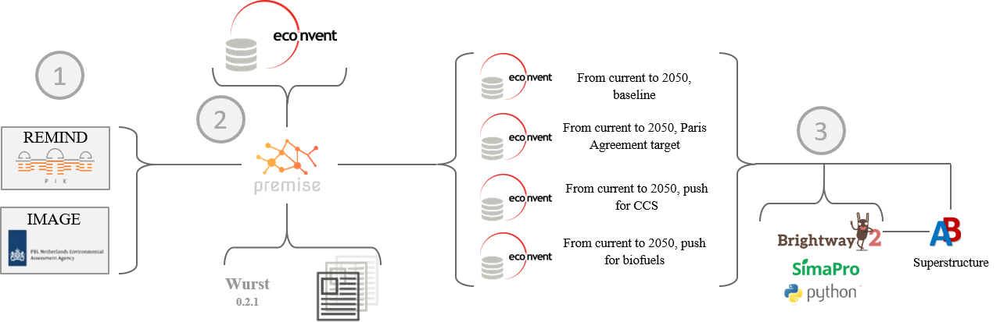

In a nutshell
"""""""""""""

Purpose
-------

*premise* enables the alignment of life cycle inventories within the ecoinvent_
3.6-3.9 database, using either a "cut-off" or "consequential"
system model, to match the output results of Integrated
Assessment Models (IAMs) such as REMIND_ or IMAGE_.
This allows for the creation of life cycle inventory databases
under future policy scenarios for any year between 2005 and 2100.

.. _ecoinvent: https://ecoinvent.org/
.. _REMIND: https://www.pik-potsdam.de/en/institute/departments/transformation-pathways/models/remind
.. _IMAGE: https://models.pbl.nl/image/index.php/Welcome_to_IMAGE_3.2_Documentation

Workflow
--------

As illustrated in the workflow diagram above, *premise* follows an Extract, Transform, Load (ETL_) process:

Extract the ecoinvent database from a Brightway_ project or from ecospold2_ files.
Expand the database by adding additional inventories related to future production pathways for certain commodities, such as electricity, steel, cement, etc.
Modify the ecoinvent database, focusing primarily on process efficiency improvements and market adjustments.
Load the updated database back into a Brightway project or export it as a set of CSV files, such as Simapro CSV files.

.. _brightway: https://brightway.dev/
.. _ecospold2: https://ecoinvent.org/the-ecoinvent-database/data-formats/ecospold2/
.. _ETL: https://www.guru99.com/etl-extract-load-process.html#:~:text=ETL%20is%20a%20process%20that,is%20Extract%2C%20Transform%20and%20Load.

Default IAM scenarios
---------------------

Provided a decryption key (ask the maintainers_), the following IAM scenarios are available when installing *premise*:

+------------------+-----------------------+------------------------------------------------------------------------------------+---------------------------------------------+-----------------+------------+
| SSP/RCP scenario | GMST increase by 2100 | Society/economy trend                                                              | Climate policy                              | REMIND          | IMAGE      |
+==================+=======================+====================================================================================+=============================================+=================+============+
+------------------+-----------------------+------------------------------------------------------------------------------------+---------------------------------------------+-----------------+------------+
| SSP1-None        | 2.3-2.8 °C            | Optimistic trends for human develop. and economy, driven by sustainable practices. | None                                        | SSP1-Base       | SSP1-Base  |
+------------------+-----------------------+------------------------------------------------------------------------------------+---------------------------------------------+-----------------+------------+
| SSP1-None        | ~2.2 °C               | Optimistic trends for human develop. and economy, driven by sustainable practices. | National Policies Implemented (NPI).        | SSP1-NPi        |            |
+------------------+-----------------------+------------------------------------------------------------------------------------+---------------------------------------------+-----------------+------------+
| SSP1-None        | ~1.9 °C               | Optimistic trends for human develop. and economy, driven by sustainable practices. | Nationally Determined Contributions (NDCs). | SSP1-NDC        |            |
+------------------+-----------------------+------------------------------------------------------------------------------------+---------------------------------------------+-----------------+------------+
| SSP1-RCP2.6      | ~1.7 °C               | Optimistic trends for human develop. and economy, driven by sustainable practices. | Paris Agreement objective.                  | SSP1-PkBudg1150 |            |
+------------------+-----------------------+------------------------------------------------------------------------------------+---------------------------------------------+-----------------+------------+
| SSP1-RCP1.9      | ~1.3 °C               | Optimistic trends for human develop. and economy, driven by sustainable practices. | Paris Agreement objective.                  | SSP1-PkBudg500  |            |
+------------------+-----------------------+------------------------------------------------------------------------------------+---------------------------------------------+-----------------+------------+
| SSP2-None        | ~3.5 °C               | Extrapolation from historical developments.                                        | None (eq. to RCP6)                          | SSP2-Base       | SSP2-Base  |
+------------------+-----------------------+------------------------------------------------------------------------------------+---------------------------------------------+-----------------+------------+
| SSP2-None        | ~3.3 °C               | Extrapolation from historical developments.                                        | National Policies Implemented (NPI).        | SSP2-NPi        |            |
+------------------+-----------------------+------------------------------------------------------------------------------------+---------------------------------------------+-----------------+------------+
| SSP2-None        | ~2.5 °C               | Extrapolation from historical developments.                                        | Nationally Determined Contributions (NDCs). | SSP2-NDC        |            |
+------------------+-----------------------+------------------------------------------------------------------------------------+---------------------------------------------+-----------------+------------+
| SSP2-RCP2.6      | 1.6-1.8 °C            | Extrapolation from historical developments.                                        | Paris Agreement objective.                  | SSP2-PkBudg1150 | SSP2-RCP26 |
+------------------+-----------------------+------------------------------------------------------------------------------------+---------------------------------------------+-----------------+------------+
| SSP2-RCP1.9      | 1.2-1.4 °C            | Extrapolation from historical developments.                                        | Paris Agreement objective.                  | SSP2-PkBudg500  | SSP2-RCP19 |
+------------------+-----------------------+------------------------------------------------------------------------------------+---------------------------------------------+-----------------+------------+
| SSP5-None        | ~4.5 °C               | Optimistic trends for human develop. and economy, driven by fossil fuels.          | None                                        | SSP5-Base       |            |
+------------------+-----------------------+------------------------------------------------------------------------------------+---------------------------------------------+-----------------+------------+
| SSP5-None        | ~4.0 °C               | Optimistic trends for human develop. and economy, driven by fossil fuels.          | National Policies Implemented (NPI).        | SSP5-NPi        |            |
+------------------+-----------------------+------------------------------------------------------------------------------------+---------------------------------------------+-----------------+------------+
| SSP5-None        | ~3.0 °C               | Optimistic trends for human develop. and economy, driven by fossil fuels.          | Nationally Determined Contributions (NDCs). | SSP5-NDC        |            |
+------------------+-----------------------+------------------------------------------------------------------------------------+---------------------------------------------+-----------------+------------+
| SSP5-RCP2.6      | ~1.7 °C               | Optimistic trends for human develop. and economy, driven by fossil fuels.          | Paris Agreement objective.                  | SSP5-PkBudg1150 |            |
+------------------+-----------------------+------------------------------------------------------------------------------------+---------------------------------------------+-----------------+------------+
| SSP5-RCP1.9      | ~1.0 °C               | Optimistic trends for human develop. and economy, driven by fossil fuels.          | Paris Agreement objective.                  | SSP5-PkBudg500  |            |
+------------------+-----------------------+------------------------------------------------------------------------------------+---------------------------------------------+-----------------+------------+

CarbonBrief_ wrote a good article explaining the meaning of the SSP/RCP system.

Additionally, we provided a summary of the main characteristics of each scenario `here <https://premisedash-6f5a0259c487.herokuapp.com/>`_.

.. _CarbonBrief: https://www.carbonbrief.org/explainer-how-shared-socioeconomic-pathways-explore-future-climate-change

You can however use any other scenario files generated by REMIND or IMAGE. If you wish to use an IAM file
which has not been generated by either of these two models, you should refer to the **Mapping** section.

.. _maintainers: mailto:romain.sacchi@psi.ch

Requirements
------------
* Python language interpreter **>=3.9**
* License for ecoinvent 3
* brightway2 (optional)

How to install this package?
----------------------------

Two options:

A development version with the latest advancements (but with the risks of unseen bugs),
is available on Anaconda Cloud:

.. code-block:: python

    conda install -c romainsacchi premise

For a more stable and proven version, from Pypi:

.. code-block:: python

    pip install premise

This will install the package and the required dependencies.

How to use it?
--------------

Examples notebook
*****************

`This notebook <https://github.com/polca/premise/blob/master/examples/examples.ipynb>`_ will show
you everything you need to know to use *premise*.

Main contributors
-----------------

* `Romain Sacchi <https://github.com/romainsacchi>`_
* `Alois Dirnaichner <https://github.com/Loisel>`_
* `Chris Mutel <https://github.com/cmutel>`_
* `Brian Cox <https://github.com/brianlcox>`_
