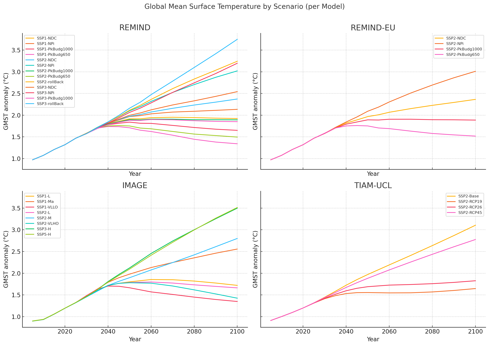

In a nutshell
"""""""""""""

Purpose
-------

*premise* enables the alignment of life cycle inventories within the ecoinvent_
3.8-3.11 database, using either a "cut-off" or "consequential"
system model, to match the output results of Integrated
Assessment Models (IAMs) such as REMIND_ (and REMIND-EU), IMAGE_ or TIAM-UCL_.
This allows for the creation of life cycle inventory databases
under future policy scenarios for any year between 2005 and 2100.

.. _ecoinvent: https://ecoinvent.org/
.. _REMIND: https://www.pik-potsdam.de/en/institute/departments/transformation-pathways/models/remind
.. _IMAGE: https://models.pbl.nl/image/index.php/Welcome_to_IMAGE_3.2_Documentation
.. _TIAM-UCL: https://www.ucl.ac.uk/energy-models/models/tiam-ucl

.. note::

    The ecoinvent database is not included in this package. You need to have a valid license for ecoinvent 3.6-3.11 to use *premise*.
    Also, please read carefully ecoinvent's EULA_ before using *premise*.

.. _EULA: https://ecoinvent.org/app/uploads/2024/01/EULA_new_branding_08_11_2023.pdf

Publication
-----------

The methodology behind *premise* is described in the following publication:

R. Sacchi, T. Terlouw, K. Siala, A. Dirnaichner, C. Bauer, B. Cox, C. Mutel, V. Daioglou, G. Luderer,
PRospective EnvironMental Impact asSEment (premise): A streamlined approach to producing databases for prospective life cycle assessment using integrated assessment models,
Renewable and Sustainable Energy Reviews, 2022, https://doi.org/10.1016/j.rser.2022.112311.

.. note::

    If you use *premise* in your research, please cite the above publication.

Additionally, you may want to cite the ecoinvent v.3 database:

Wernet, G. et al. The ecoinvent database version 3 (part I): overview and methodology. Int. J. Life Cycle Assess. 21, 1218–1230 (2016) . http://link.springer.com/10.1007/s11367-016-1087-8.

Finally, you may want to cite the IAM model used with *premise*:

* REMIND: Baumstark et al. REMIND2.1: transformation and innovation dynamics of the energy-economic system within climate and sustainability limits, Geoscientific Model Development, 2021.
* IMAGE: Stehfest, Elke, et al. Integrated assessment of global environmental change with IMAGE 3.0: Model description and policy applications. Netherlands Environmental Assessment Agency (PBL), 2014.
* TIAM-UCL: Pye, S., et al. The TIAM-UCL Model (Version 4.1.1) Documentation, 2020.

Models
------

+-------------+---------------------------------------------------------------------------------------------------------------------------------------------------------------------------------------------------------------------------------------------------------------+
| Model       | Description                                                                                                                                                                                                                                                   |
+=============+===============================================================================================================================================================================================================================================================+
| REMIND      | REMIND (Regionalized Model of Investment and Development) is an integrated assessment model that combines macroeconomic growth, energy system, and climate policy analysis. It is designed to analyze long-term energy transition pathways, accounting for    |
|             | technological, economic, and environmental factors. REMIND simulates how regions invest in different technologies and energy resources to balance economic growth and climate targets, while considering factors like energy efficiency, emissions, and       |
|             | resource availability. The model is particularly strong in its detailed representation of energy markets and macroeconomic interactions across regions, making it valuable for global climate policy assessments.                                             |
+-------------+---------------------------------------------------------------------------------------------------------------------------------------------------------------------------------------------------------------------------------------------------------------+
| REMIND-EU   | REMIND-EU is a regionalized version of the REMIND model, specifically tailored to analyze energy systems and climate policies within the European Union. It incorporates detailed representations of EU member states' energy markets, technological options, |
|             | and policy frameworks. It allows for a more granular analysis of how EU-specific policies, such as the European Green Deal, affect energy transition pathways, emissions reductions, and economic development within the EU context.                          |
+-------------+---------------------------------------------------------------------------------------------------------------------------------------------------------------------------------------------------------------------------------------------------------------+
| IMAGE       | IMAGE (Integrated Model to Assess the Global Environment) is a comprehensive IAM developed to explore the interactions between human development, energy consumption, and environmental systems over the long term. It focuses on assessing how land use,     |
|             | food systems, energy systems, and climate change interact under different policy scenarios. The model integrates biophysical processes, such as land-use change and greenhouse gas emissions, with socio-economic drivers like population growth and economic |
|             | development. IMAGE is commonly used for analyzing sustainable development strategies, climate impacts, biodiversity loss, and exploring mitigation and adaptation options.                                                                                    |
+-------------+---------------------------------------------------------------------------------------------------------------------------------------------------------------------------------------------------------------------------------------------------------------+
| TIAM-UCL    | TIAM-UCL (TIMES Integrated Assessment Model by University College London) is a global energy system model based on the TIMES (The Integrated MARKAL-EFOM System) framework, developed to evaluate long-term decarbonization pathways for global energy        |
|             | systems. It provides detailed insights into energy technology options, resource availability, and emission reduction strategies under various climate policy scenarios. The model focuses on the trade-offs and synergies between energy security, economic   |
|             | costs, and environmental outcomes. TIAM-UCL is frequently used to analyze scenarios consistent with the Paris Agreement and examine technological innovation's role in mitigating climate change globally.                                                    |
+-------------+---------------------------------------------------------------------------------------------------------------------------------------------------------------------------------------------------------------------------------------------------------------+

Quick Reference
---------------

+---------------------+---------------+---------------+---------------+-----------------+
| Property            | REMIND        | REMIND-EU     | IMAGE         | TIAM-UCL        |
+=====================+===============+===============+===============+=================+
| **Model Type**      | CGE + Energy  | CGE + Energy  | IAM (PEM)     | Bottom-up       |
| **Foresight**       | ✓ Perfect     | ✓ Perfect     | ✗ Myopic      | ✓ Perfect       |
| **Energy System**   | ✓ Detailed    | ✓ Detailed    | ✓ Moderate    | ✓ Very detailed |
| **Land Use**        | ✓ (MAGPIE)    | ✓ (MAGPIE)    | ✓ Integrated  | ✗               |
| **Regional Focus**  | Global        | EU + Global   | Global        | Global          |
| **Key Strength**    | Energy-economy| EU policies   | Land & climate| Tech pathways   |
+---------------------+---------------+---------------+---------------+-----------------+

**REMIND**
REMIND (Regionalized Model of Investment and Development) is a CGE-based energy-economy IAM with perfect
foresight. Its main strength lies in capturing interactions between macroeconomic growth and energy
transitions across 12–13 global regions. Compared to IMAGE, REMIND provides more detailed energy market
and investment dynamics, but it lacks IMAGE's rich land-use and biodiversity modules. Compared to
TIAM-UCL, REMIND emphasizes macroeconomic feedbacks over technological granularity, making it
better for studying long-term global climate policies rather than detailed technology pathways.
REMIND-EU builds directly on REMIND but adds EU-specific regionalization.

**REMIND-EU**
REMIND-EU is a regionalized version of REMIND, designed to analyze the European Union’s energy
transition with country-level resolution (at least, for France, Germany, and the UK). It retains
REMIND’s CGE approach and perfect foresight but includes EU-specific policies and technologies,
which are less detailed in the global REMIND model. Compared to IMAGE, REMIND-EU still lacks a
strong land-use component, but its granularity for  EU energy systems makes it preferable for
studying European Green Deal scenarios. Compared to TIAM-UCL, REMIND-EU has less technology detail
but better macroeconomic and cross-sectoral insights for EU policymaking.

**IMAGE**
IMAGE (Integrated Model to Assess the Global Environment) is a simulation-based IAM with a
recursive-dynamic structure (myopic foresight). It excels in land-use, agriculture, and
biodiversity modeling, making it the best choice for scenarios that involve climate–ecosystem
interactions. Compared to REMIND and TIAM-UCL, IMAGE has less detailed energy system modeling and
no explicit macroeconomic CGE framework. However, its biophysical integration and land-use modeling
(unlike TIAM-UCL, which lacks this entirely) makes it complementary to energy-focused models.

**TIAM-UCL**
TIAM-UCL is a bottom-up, technology-rich energy system model based on linear optimization
with perfect foresight. It focuses on detailed technology pathways, energy supply chains,
and long-term decarbonization strategies. Compared to REMIND and IMAGE, TIAM-UCL lacks
macroeconomic modeling and has no integrated land-use module, but it provides superior
technology detail and resource-specific analyses (e.g., hydrogen pathways, renewables
deployment). It is particularly suited for Paris Agreement-compliant energy transitions
and cost-optimal technology portfolios.

Choosing the Right IAM
----------------------

Selecting the appropriate IAM for use with *premise* depends on the focus of your study:

- **REMIND** is best suited for **global energy–economy transition analyses** where the interplay between macroeconomic growth, energy markets, and climate policies is key.
- **REMIND-EU** is ideal for **EU-focused studies**, particularly those assessing the **European Green Deal** or country-level decarbonization strategies within the EU.
- **IMAGE** is the preferred choice when **land-use change, agriculture, biodiversity, or climate–ecosystem interactions** are central to the analysis. Its biophysical and environmental modules complement energy-focused IAMs.
- **TIAM-UCL** is most appropriate for exploring **detailed technology pathways**, resource allocation, and **cost-optimal energy system designs**, particularly for **Paris Agreement-compatible scenarios**.

Our recommendation is to assess the sensitivity of your results across different IAMs for a given climate target.
IAMs will deploy different technologies and resources to achieve the same climate target, which will lead to different life cycle inventories.

Additionally, the level of sectoral integration in **premise** varies across IAMs, which can affect the results.

This table below summarize the numbers of variables mapping with **premise** for each IAM and sector:

+--------------------------+---------+----------+-------------+------------+
| Sector                   |   image |   remind |   remind-eu |   tiam-ucl |
+==========================+=========+==========+=============+============+
| Biomass                  |       3 |        2 |           2 |          2 |
| Carbon Dioxide Removal   |       2 |        7 |           7 |          2 |
| Cement                   |      10 |        4 |           4 |          2 |
| Crops                    |       5 |        0 |           0 |          1 |
| Electricity              |      51 |       34 |          34 |         61 |
| Fuels                    |      53 |       42 |          42 |         55 |
| Heat                     |      14 |       24 |          24 |          2 |
| Other                    |       4 |        4 |           4 |          4 |
| Steel                    |      22 |       12 |          12 |         12 |
| Transport Bus            |       8 |        8 |           8 |         12 |
| Transport Passenger Cars |       8 |       60 |          60 |         20 |
| Transport Rail Freight   |       6 |        6 |           6 |          4 |
| Transport Road Freight   |      14 |       40 |          40 |         50 |
| Transport Sea Freight    |       8 |       12 |          12 |         13 |
| Transport Two Wheelers   |       0 |       12 |          12 |          0 |
+--------------------------+---------+----------+-------------+------------+

And here is a plot of the same data:

.. image:: mapped_vars_comparison.png.png
   :width: 600pt
   :align: center

The table and plot show how **premise** connects to IMAGE, REMIND, REMIND-EU, and TIAM-UCL,
focusing on energy generation, industry, and transport:

* REMIND and REMIND-EU have the broadest coverage, with strong mappings in electricity (34 variables), fuels (42 variables), and transport, especially passenger cars (60 variables) and road freight (40 variables).
* IMAGE offers extensive integration (417 variables), particularly in electricity (51 variables), fuels (53 variables), and industrial sectors like cement (10 variables) and steel (22 variables). However, two-wheelers are not covered by IMAGE.
* TIAM-UCL is highly detailed in electricity (61 variables), fuels (55 variables), and road freight (50 variables) but has lower coverage in cement and heat compared to REMIND and IMAGE.

Sectoral observations:

* Electricity and fuels remain the most consistently mapped sectors across all models.
* Transport sub-sectors (bus, passenger cars, rail, road, and sea freight) are well represented in REMIND(-EU) and TIAM-UCL, with IMAGE covering all except two-wheelers.
* Industrial sectors, particularly steel and cement, are better represented in IMAGE and REMIND(-EU) than in TIAM-UCL.

**IMAGE**
*Strengths:*

* Strong coverage of electricity (51 variables) and fuels (53 variables).
* Detailed industrial sectors, especially cement (10) and steel (22).
* Broad mapping across transport sub-sectors, except for two-wheelers.

*Limitation:*

* No coverage of two-wheelers, and fewer transport details than REMIND for passenger cars.

**REMIND**
*Strengths:*

* Broad coverage of electricity (34) and fuels (42).
* Highly detailed transport, with 60 variables for passenger cars and 40 for road freight.
* Comprehensive coverage of carbon dioxide removal (7).

*Limitation:*

* Less detailed in cement and steel compared to IMAGE.

**REMIND-EU**
*Strengths:*

* Same broad mapping as REMIND, but with EU-specific detail.
* Excellent coverage of transport and fuels, aligned with EU decarbonization pathways.
* Includes CO₂ removal and electricity in high detail.

* Limitation:*

* Industrial coverage (cement, steel) is moderate compared to IMAGE.
* Not as many scenarios available as for REMIND.

**TIAM-UCL**
*Strengths:*

* Strong focus on electricity (61) and fuels (55).
* Detailed road freight (50) and transport mapping.
* Good coverage of passenger cars (20 variables).

*Limitation:*

* Limited representation of cement (2) and heat (2) sectors.

Choosing the right scenario
---------------------------

The choice of scenario depends on the climate target you want to achieve,
the IAM you want to use, and the sectoral integration level you need.

Here is a comparison regarding the global mean surface temperature (GMST) increase by 2100:

+-----------------------------+--------+-----------+-----------+-----------+-----------+-----------+-----------+-----------+--------+
| Scenario                    | <1.5   | 1.5–1.7   | 1.7–2.0   | 2.0–2.5   | 2.5–2.8   | 2.8–3.0   | 3.0–3.2   | 3.2–3.5   | >3.5   |
+=============================+========+===========+===========+===========+===========+===========+===========+===========+========+
| remind - SSP1-PkBudg650     | ✓      |           |           |           |           |           |           |           |        |
| image - SSP1-VLLO           | ✓      |           |           |           |           |           |           |           |        |
| image - SSP2-VLHO           | ✓      |           |           |           |           |           |           |           |        |
| remind - SSP2-PkBudg650     | ✓      |           |           |           |           |           |           |           |        |
| remind-eu - SSP2-PkBudg650  |        | ✓         |           |           |           |           |           |           |        |
| tiam-ucl - SSP2-RCP19       |        | ✓         |           |           |           |           |           |           |        |
| remind - SSP1-PkBudg1000    |        | ✓         |           |           |           |           |           |           |        |
| image - SSP2-L              |        | ✓         |           |           |           |           |           |           |        |
| image - SSP1-L              |        |           | ✓         |           |           |           |           |           |        |
| tiam-ucl - SSP2-RCP26       |        |           | ✓         |           |           |           |           |           |        |
| remind - SSP3-PkBudg1000    |        |           | ✓         |           |           |           |           |           |        |
| remind-eu - SSP2-PkBudg1000 |        |           | ✓         |           |           |           |           |           |        |
| remind - SSP2-PkBudg1000    |        |           | ✓         |           |           |           |           |           |        |
| remind - SSP1-NDC           |        |           | ✓         |           |           |           |           |           |        |
| remind - SSP1-NPi           |        |           |           | ✓         |           |           |           |           |        |
| remind-eu - SSP2-NDC        |        |           |           | ✓         |           |           |           |           |        |
| remind - SSP2-NDC           |        |           |           | ✓         |           |           |           |           |        |
| remind - SSP3-NDC           |        |           |           |           | ✓         |           |           |           |        |
| image - SSP1-Ma             |        |           |           |           | ✓         |           |           |           |        |
| tiam-ucl - SSP2-RCP45       |        |           |           |           | ✓         |           |           |           |        |
| image - SSP2-M              |        |           |           |           |           | ✓         |           |           |        |
| remind-eu - SSP2-NPi        |        |           |           |           |           |           | ✓         |           |        |
| remind - SSP2-NPi           |        |           |           |           |           |           | ✓         |           |        |
| tiam-ucl - SSP2-Base        |        |           |           |           |           |           | ✓         |           |        |
| remind - SSP3-NPi           |        |           |           |           |           |           | ✓         |           |        |
| remind - SSP2-rollBack      |        |           |           |           |           |           |           | ✓         |        |
| image - SSP3-H              |        |           |           |           |           |           |           | ✓         |        |
| image - SSP5-H              |        |           |           |           |           |           |           |           | ✓      |
| remind - SSP3-rollBack      |        |           |           |           |           |           |           |           | ✓      |
+-----------------------------+--------+-----------+-----------+-----------+-----------+-----------+-----------+-----------+--------+

And here is a plot of the same data:

Workflow
--------

.. image:: main_workflow.png

As illustrated in the workflow diagram above, *premise* follows an Extract, Transform, Load (ETL_) process:

1. Extract the ecoinvent database from a Brightway_ project or from ecospold2_ files.
2. Expand the database by adding additional inventories for future production pathways for certain commodities, such as electricity, heat, steel, cement, etc.
3. Modify the ecoinvent database, focusing primarily on process efficiency improvements and market adjustments.
4. Load the updated database back into a Brightway project or export it as a set of CSV files, such as Simapro CSV files.

.. _brightway: https://brightway.dev/
.. _ecospold2: https://ecoinvent.org/the-ecoinvent-database/data-formats/ecospold2/
.. _ETL: https://www.guru99.com/etl-extract-load-process.html#:~:text=ETL%20is%20a%20process%20that,is%20Extract%2C%20Transform%20and%20Load.

Default IAM scenarios
---------------------

Provided a decryption key (ask the maintainers_), the following IAM scenarios are available when
installing *premise*:

+------------------+-----------------------+-------------------------------------------+---------------------------------+-----------+------------+
| SSP scenario     | GMST increase by 2100 | Climate policy / label                    | REMIND                          | IMAGE     | TIAM-UCL   |
+==================+=======================+===========================================+=================================+===========+============+
| **SSP1**         | 2.56°C                | Medium forcing                            |                                 | SSP1-Ma   |            |
| **SSP1**         | 1.72°C                | Low forcing                               |                                 | SSP1-L    |            |
| **SSP1**         | 1.35°C                | Very low forcing                          |                                 | SSP1-VLLO |            |
| **SSP1**         | 1.92°C                | NDC (nat. determined contributions)       | SSP1-NDC                        |           |            |
| **SSP1**         | 2.13°C                | NPI (nat. policies implemented)           | SSP1-NPi                        |           |            |
| **SSP1**         | 1.3–1.7°C             | Paris-consistent (peak budget)            | SSP1-PkBudg650, SSP1-PkBudg1000 |           |            |
| **SSP2**         | 3.11°C                | Base (no explicit policy, TIAM reference) |                                 |           | SSP2-Base  |
| **SSP2**         | 1.66°C                | Low forcing                               |                                 | SSP2-L    |            |
| **SSP2**         | 2.80°C                | Medium forcing                            |                                 | SSP2-M    |            |
| **SSP2**         | 1.42°C                | Very low/high forcing (IMAGE VLHO)        |                                 | SSP2-VLHO |            |
| **SSP2**         | 2.36°C                | NDC (nat. determined contributions)       | SSP2-NDC                        |           |            |
| **SSP2**         | 3.0°C                 | NPI (nat. policies implemented)           | SSP2-NPi                        |           |            |
| **SSP2**         | 1.50–1.9°C            | Paris-consistent (peak budget)            | SSP2-PkBudg650, SSP2-PkBudg1000 |           |            |
| **SSP2**         | 3.24°C                | Rollback                                  | SSP2-rollBack                   |           |            |
| **SSP2–RCP1.9**  | 1.65°C                | Paris-consistent                          |                                 |           | SSP2-RCP19 |
| **SSP2–RCP2.6**  | 1.83°C                | Paris-consistent                          |                                 |           | SSP2-RCP26 |
| **SSP2–RCP4.5**  | 2.78°C                | Weaker policy                             |                                 |           | SSP2-RCP45 |
| **SSP3**         | 3.50°C                | High forcing                              |                                 | SSP3-H    |            |
| **SSP3**         | 2.54°C                | NDC (nat. determined contributions)       | SSP3-NDC                        |           |            |
| **SSP3**         | 3.20°C                | NPI (nat. policies implemented)           | SSP3-NPi                        |           |            |
| **SSP3**         | 1.85°C                | Paris-consistent (peak budget)            | SSP3-PkBudg1000                 |           |            |
| **SSP3**         | 3.75°C                | Rollback                                  | SSP3-rollBack                   |           |            |
| **SSP5**         | 3.51°C                | High forcing                              |                                 | SSP5-H    |            |
+------------------+-----------------------+-------------------------------------------+---------------------------------+-----------+------------+

CarbonBrief_ wrote a good article explaining the meaning of the SSP/RCP system.

Additionally, we provided a summary of the main characteristics of each scenario `here <https://premisedash-6f5a0259c487.herokuapp.com/>`_.

.. _CarbonBrief: https://www.carbonbrief.org/explainer-how-shared-socioeconomic-pathways-explore-future-climate-change

If you wish to use an IAM file which has not been generated by either of these
above-listed models, you should refer to the **Mapping** section.

.. _maintainers: mailto:romain.sacchi@psi.ch

Requirements
------------
* Python language interpreter **>=3.9**
* License for ecoinvent 3
* Brightway 2 or 2.5 (optional)

.. note::

    If you wish to export Brightway 2.5-compatible databases, you will need to upgrade `bw2data` to >= 4.0.0.

How to install this package?
----------------------------

Two options:

From Pypi:

    pip install premise

will install the package and the required dependencies.

``premise`` comes with the latest version of ``brightway``, which is Brightway 2.5.
This means that ``premise`` will output databases that are compatible with Brightway 2.5.

If you want to use the results in the Brightway 2 framework (e.g., to read them in ``activity-browser``),
you need to specify it in the installation command:

    pip install "premise[bw2]"

You can also specify that you want to use Brightway 2.5:

    pip install "premise[bw25]"

A development version with the latest advancements (but with the risks of unseen bugs),
is available from Anaconda Cloud. Similarly, you should specify that you want to use Brightway 2.5:

    conda install -c conda-forge premise-bw25

Or rather use Brightway2 (for Activity Browser-compatibility):

    conda install -c conda-forge premise-bw2

How to use it?
--------------

Examples notebook
*****************

`This notebook <https://github.com/polca/premise/blob/master/examples/examples.ipynb>`_ will show
you everything you need to know to use *premise*.

ScenarioLink plugin
*******************
There now exists a plugin for Activity Browser, called ScenarioLink, which allows you to
directly download IAM scenario-based premise databases from the browser, without the use of premise.
You can find it `here <https://github.com/polca/ScenarioLink>`_.

Active contributors
-------------------

* `Romain Sacchi <https://github.com/romainsacchi>`_
* `Alvaro Hahn Menacho <https://github.com/alvarojhahn>`_

Historical contributors
-----------------------

* `Alois Dirnaichner <https://github.com/Loisel>`_
* `Chris Mutel <https://github.com/cmutel>`_
* `Brian Cox <https://github.com/brianlcox>`_
