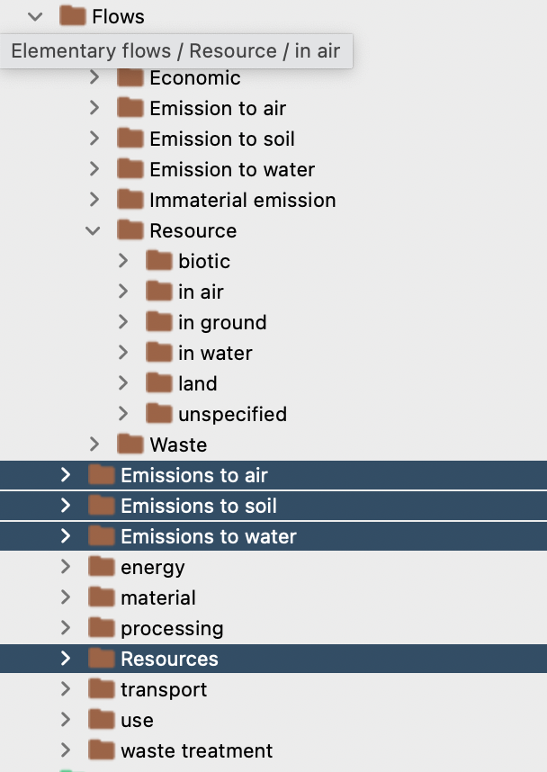
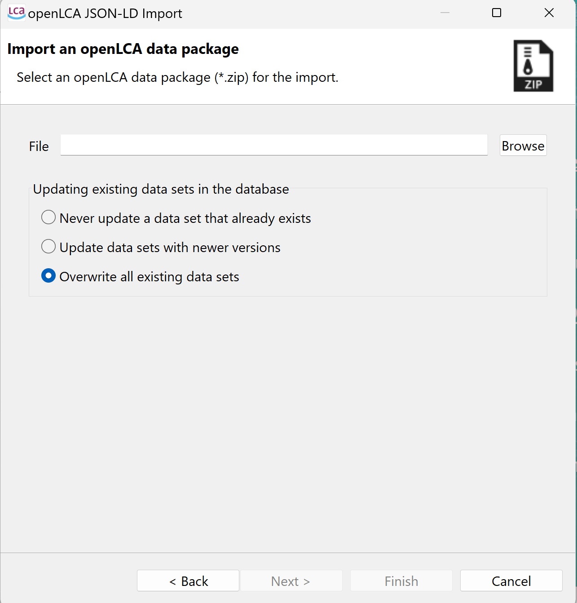

LOAD
====

Back to a brightway2 project
----------------------------

Regular brightway2 database
***************************

*premise* uses *bw2io* to load the LCI database back into a *brightway2* project.
This is done as follows:

.. code-block:: python

    ndb.write_db_to_brightway()

If several databases have been built, the user can give them specific names, like so:

.. code-block:: python

    ndb.write_db_to_brightway(name=["db_1", "db_2"])

Superstructure database
***********************

If several scenario databases are built, *premise* can generate a superstructure database,
as explained in Steubing_ et al, 2021. This allows to explore several scenarios
while writing only one database in a brightway2 project. Besides writing the
database to disk, this also creates a *scenario difference file* that will be read
by Activity-Browser_.

.. _Steubing: https://link.springer.com/article/10.1007/s11367-021-01974-2
.. _Activity-Browser: https://github.com/LCA-ActivityBrowser/activity-browser

This is done as follows:

.. code-block:: python

    ndb.write_superstructure_db_to_brightway()

You can also specify a file path for the export of the scenario
difference file:

.. code-block:: python

    ndb.write_superstructure_db_to_brightway(filepath="some_file_path")

Finally, you can also give a name to the superstructure database:

.. code-block:: python

    ndb.write_superstructure_db_to_brightway(filepath="some_file_path", name="my_db")

.. note::

    Superstructure databases can only be used by Activity-Browser at the moment.

As sparse matrices
------------------

*premise* can generate a sparse matrix representation of the database(s). This is useful
when no LCA software can be used, or when connections to SQL databases should be avoided.

This is done as follows::

    ndb.write_db_to_matrices()

This creates a set of CSV files:

* a CSV file that represents product exchanges between activities, under the form [*a*, *b*, *x*]
* a CSV file that represent natural flow exchanges between activities and the biosphere, under the form [*a*, *c*, *x*]
* and another two CSV files contains the mapping between the activity names are the indices in the matrices

with *a* being the row index of an activity, *b* being the column index of an activity,
*c* being a natural flow, and *x* being the value exchanged.

For example, the following piece of script calculates the GWP score of all activities in the database:

.. code-block:: python

    """ COLLECT DATA """
    # creates dict of activities <--> indices in A matrix
    A_inds = dict()
    with open("A_matrix_index.csv", 'r') as read_obj:
        csv_reader = reader(read_obj, delimiter=";")
        for row in csv_reader:
            A_inds[(row[0], row[1], row[2], row[3])] = row[4]
    A_inds_rev = {int(v):k for k, v in A_inds.items()}

    # creates dict of bio flow <--> indices in B matrix
    B_inds = dict()
    with open("B_matrix_index.csv", 'r') as read_obj:
        csv_reader = reader(read_obj, delimiter=";")
        for row in csv_reader:
            B_inds[(row[0], row[1], row[2], row[3])] = row[4]
    B_inds_rev = {int(v):k for k, v in B_inds.items()}

    # create a sparse A matrix
    A_coords = np.genfromtxt("A_matrix.csv", delimiter=";", skip_header=1)
    I = A_coords[:, 0].astype(int)
    J = A_coords[:, 1].astype(int)
    A = sparse.csr_matrix((A_coords[:,2], (J, I)))

    # create a sparse B matrix
    B_coords = np.genfromtxt("B_matrix.csv", delimiter=";", skip_header=1)
    I = B_coords[:, 0].astype(int)
    J = B_coords[:, 1].astype(int)
    B = sparse.csr_matrix((B_coords[:,2] *- 1, (I, J)), shape=(A.shape[0], len(B_inds)))

    # a vector with a few GWP CFs
    gwp = np.zeros(B.shape[1])

    gwp[[int(B_inds[x]) for x in B_inds if x[0]=="Carbon dioxide, non-fossil, resource correction"]] = -1
    gwp[[int(B_inds[x]) for x in B_inds if x[0]=="Hydrogen"]] = 5
    gwp[[int(B_inds[x]) for x in B_inds if x[0]=="Carbon dioxide, in air"]] = -1
    gwp[[int(B_inds[x]) for x in B_inds if x[0]=="Carbon dioxide, non-fossil"]] = 1
    gwp[[int(B_inds[x]) for x in B_inds if x[0]=="Carbon dioxide, fossil"]] = 1
    gwp[[int(B_inds[x]) for x in B_inds if x[0]=="Carbon dioxide, from soil or biomass stock"]] = 1
    gwp[[int(B_inds[x]) for x in B_inds if x[0]=="Carbon dioxide, to soil or biomass stock"]] = -1

    l_res = []
    for v in range(0, A.shape[0]):
        f = np.float64(np.zeros(A.shape[0]))
        f[v] = 1
        A_inv = spsolve(A, f)
        C = A_inv * B
        l_res.append((C * gwp).sum())

As Simapro CSV files
--------------------

*premise* can export the databases as Simapro-CSV files.

This is done as follows:

.. code-block:: python

    ndb.write_db_to_simapro()

.. note::

    The categorization of activities in the Simapro activity tree looks different
    from that of the original ecoinvent database accessed from Simapro. That is because
    *premise* relies on ISIC v.4 and CCP classifications to categorize activities.
    Also, a number of activities do not have a category and are found under *Meterials/Others*.

As Simapro CSV files for OpenLCA
--------------------------------

*premise* can export the databases as a modified version
of Simapro-CSV files compatible with OpenLCA.

This is done as follows:

.. code-block:: python

    ndb.write_db_to_olca()

.. note::

    The categorization of imported activities may differ from OpenLCA's
    original classification.

The Simapro CSV files can be imported in OpenLCA in a new database like so:

.. image:: olca_fig1.png
   :width: 500pt
   :align: center

You will need to select "SimaproCSV_Import.csv" as mapping file to use.

.. image:: olca_fig2.png
   :width: 500pt
   :align: center

Finally, once imported, unlinked flows remain. They can be found under these highlighted folders:

To link them, you need to import an additional mapping flow that you can find here
("Tools" > "Flow mapping" > "Open file").

And then go to "Flow mapping" > "Apply on database".
A few dozens of unlinked flows will remain. You may fix that by manually mapping them.

As a data package
-----------------

*premise* can export the databases as a data package, which is a standardized way of
packaging data. This is useful when you want to share your databases with others,
without sharing the source database (i.e., ecoinvent), which is under restrictive license.

This is done as follows:

.. code-block:: python

    ndb.write_db_to_datapackage()

This creates a zip file that contains the all the data necessary for
other users to replicate the databases, provided they have access
to the source database locally.

See the library <``unfold`` https://github.com/polca/unfold/tree/main>_ for more information on data packages
for sharing LCA databases. ``unfold`` can read these data packages and create
brightway2 databases (or superstructure databases) from them.
``unfold`` can also fold premise databases registered in your brightway2 project
into data packages, to be shared with and recreated by others.

