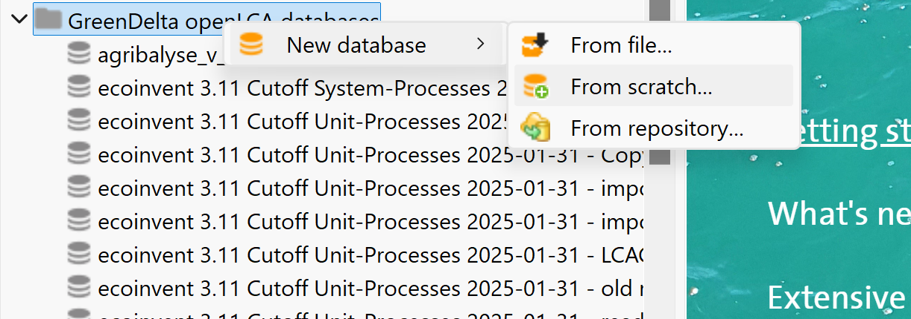
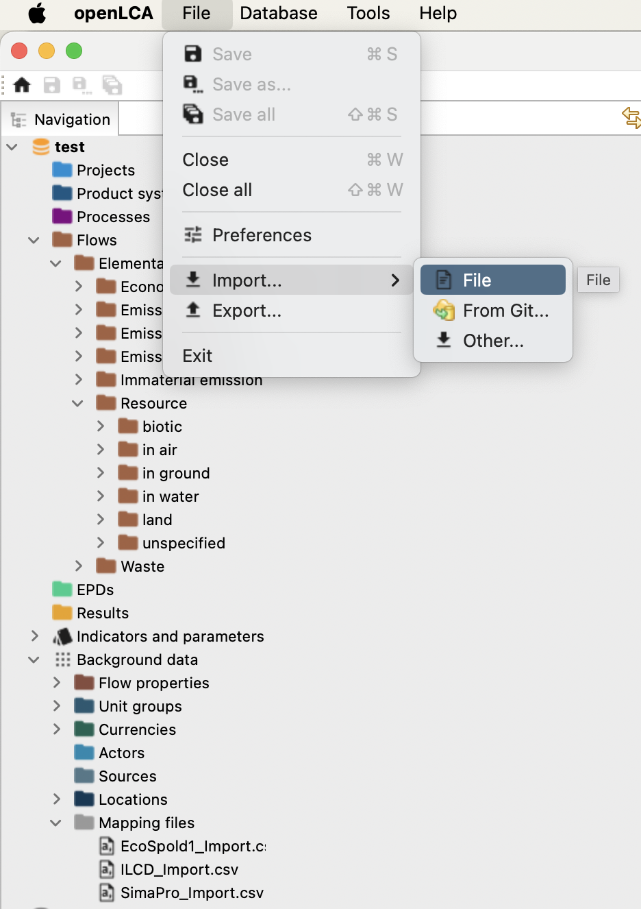
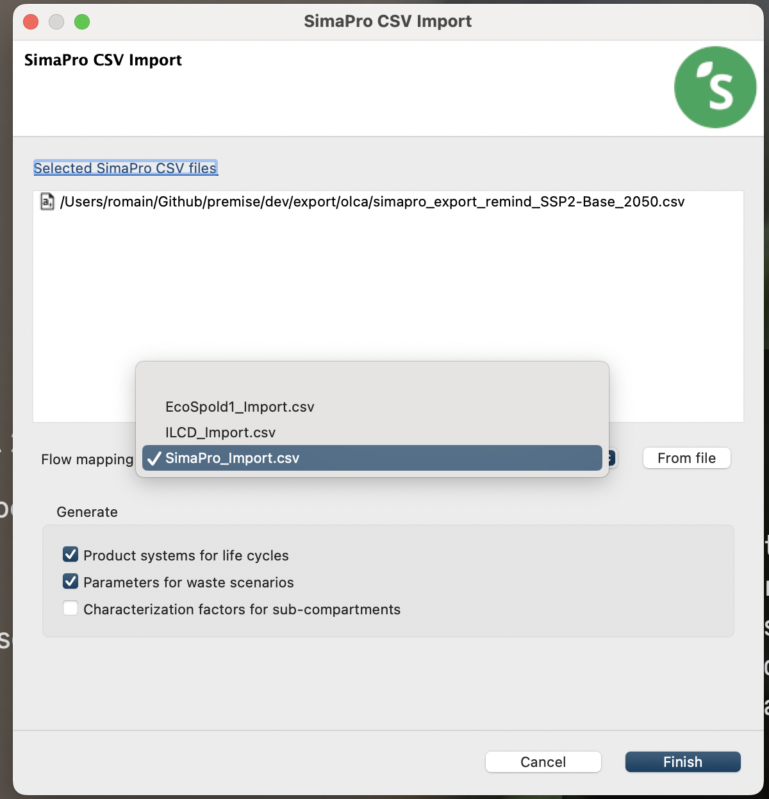
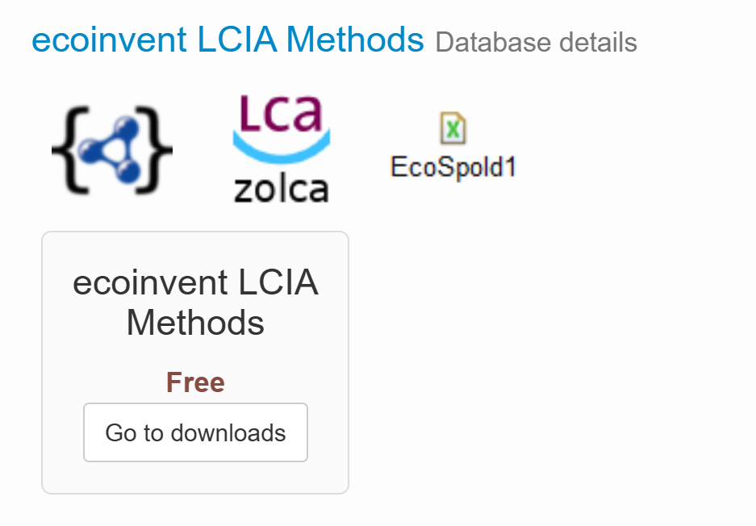
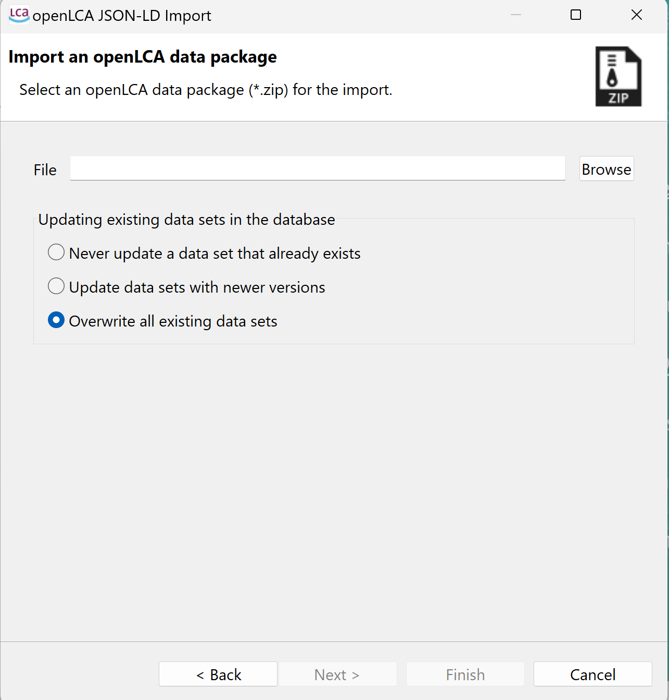

LOAD
====

Back to a brightway2 project
----------------------------

Regular brightway2 database
***************************

*premise* uses its Brightway2/Brightway25 adapters to load the LCI database back into a *brightway2* project.
This is done as follows:

.. code-block:: python

    ndb.write_db_to_brightway()

If several databases have been built, the user can give them specific names, like so:

.. code-block:: python

    ndb.write_db_to_brightway(name=["db_1", "db_2"])

.. note::

    Brightway export requires an active Brightway project with the configured
    biosphere database already registered.

Superstructure database
***********************

If several scenario databases are built, *premise* can generate a superstructure database,
as explained in Steubing_ et al, 2021. This allows to explore several scenarios
while writing only one database in a brightway2 project. Besides writing the
database to disk, this also creates a *scenario difference file* that will be read
by Activity-Browser_.

.. _Steubing: https://link.springer.com/article/10.1007/s11367-021-01974-2
.. _Activity-Browser: https://github.com/LCA-ActivityBrowser/activity-browser

This is done as follows:

.. code-block:: python

    ndb.write_superstructure_db_to_brightway()

.. note::

    Superstructure export requires at least two scenarios; otherwise ``write_superstructure_db_to_brightway``
    raises an error.

You can also specify a file path for the export of the scenario
difference file:

.. code-block:: python

    ndb.write_superstructure_db_to_brightway(filepath="some_file_path")

Finally, you can also give a name to the superstructure database:

.. code-block:: python

    ndb.write_superstructure_db_to_brightway(filepath="some_file_path", name="my_db")

.. note::

    Superstructure databases can only be used by Activity-Browser at the moment.

Sequential scenario arrays (modern Brightway)
**********************************************

With modern Brightway (``bw2data >= 4``), *premise* can write one union
database and one compressed ``bw_processing`` ZIP for deterministic scenario
enumeration. The package contains joint technosphere and biosphere arrays in
this order: ``original`` first, followed by the generated scenarios in
``ndb.scenarios`` order.

This export is useful when the same functional unit must be evaluated across
many *premise* scenarios without writing one Brightway database per scenario.
It is separate from the Activity Browser superstructure workflow: no scenario
difference CSV is created.

Requirements and output
^^^^^^^^^^^^^^^^^^^^^^^

The export requires all of the following:

* modern Brightway (``bw2data >= 4``) and ``bw_processing >= 1.0``;
* an active Brightway project containing the source and configured biosphere
  databases;
* at least two generated scenarios with unique labels; and
* a completed scenario transformation, normally ``ndb.update()``.

Calling ``write_scenario_array_db_to_brightway`` writes the union database to
the active project before resolving the Brightway IDs used by the array ZIP.
The return value is the absolute path to the ZIP. If ``filepath`` is omitted,
the package is written to
``export/scenario arrays/scenario_array_<sanitized-name>.zip``. When supplied,
``filepath`` is the complete destination filename and must end in ``.zip``;
missing parent directories are created and an existing ZIP is replaced
atomically.

Complete three-scenario IMAGE example
^^^^^^^^^^^^^^^^^^^^^^^^^^^^^^^^^^^^^

The following example uses the ``ecoinvent-3.12-cutoff`` project and applies
all sector updates to three IMAGE pathways for 2050. Set ``PREMISE_KEY`` in the
environment before running it. The source and biosphere database names must
match the names registered in your project.

.. code-block:: python

    import os

    import bw2data as bd

    from premise import NewDatabase

    PROJECT = "ecoinvent-3.12-cutoff"
    SOURCE_DATABASE = "ecoinvent-3.12-cutoff"
    BIOSPHERE_DATABASE = "ecoinvent-3.12-biosphere"
    DATABASE_NAME = "premise-image-2050-three-pathways-array"
    SCENARIOS = [
        {"model": "image", "pathway": "SSP1-L", "year": 2050},
        {"model": "image", "pathway": "SSP2-M", "year": 2050},
        {"model": "image", "pathway": "SSP3-H", "year": 2050},
    ]

    bd.projects.set_current(PROJECT)
    missing = [
        name
        for name in (SOURCE_DATABASE, BIOSPHERE_DATABASE)
        if name not in bd.databases
    ]
    if missing:
        raise ValueError(f"Missing Brightway databases: {missing}")

    ndb = NewDatabase(
        scenarios=SCENARIOS,
        source_db=SOURCE_DATABASE,
        source_version="3.12",
        source_type="brightway",
        system_model="cutoff",
        biosphere_name=BIOSPHERE_DATABASE,
        key=os.environ["PREMISE_KEY"],
    )
    ndb.update()  # apply all sector transformations

    array_path = ndb.write_scenario_array_db_to_brightway(
        name=DATABASE_NAME,
    )
    print(array_path)

The one export call writes both ``DATABASE_NAME`` to the active Brightway
project and the returned array ZIP. Do not call ``write_db_to_brightway`` first
for the same database name.

Calculate and enumerate scores
^^^^^^^^^^^^^^^^^^^^^^^^^^^^^^

Select activities by their name, reference product, and location, and require
exactly one match. This example evaluates one kilowatt-hour of Swiss
low-voltage electricity with the ecoinvent 3.12 EF v3.1 GWP100 method.

.. code-block:: python

    import bw2calc as bc
    import numpy as np

    from premise.utils import create_scenario_list

    method = (
        "ecoinvent-3.12",
        "EF v3.1",
        "climate change",
        "global warming potential (GWP100)",
    )
    if method not in bd.methods:
        raise ValueError(f"Missing LCIA method: {method}")

    database = bd.Database(DATABASE_NAME)
    matches = [
        activity
        for activity in database
        if activity.get("name") == "market for electricity, low voltage"
        and activity.get("reference product") == "electricity, low voltage"
        and activity.get("location") == "CH"
    ]
    if len(matches) != 1:
        raise ValueError(f"Expected one matching activity; found {len(matches)}")
    functional_unit = matches[0]

    demand, data_objs, remapping = bd.prepare_lca_inputs(
        {functional_unit: 1},
        method=method,
    )

    lca = bc.LCA(
        demand,
        data_objs=[*data_objs, array_path],
        remapping_dicts=remapping,
        use_arrays=True,
        use_distributions=False,
    )

    lca.lci()
    lca.lcia()
    scores = [lca.score]  # original

    for _ in ndb.scenarios:
        next(lca)
        scores.append(lca.score)

    labels = ["original", *create_scenario_list(ndb.scenarios)]
    print(dict(zip(labels, scores)))

    # The next selection after the final scenario wraps to original.
    next(lca)
    assert np.isclose(lca.score, scores[0])

The returned ZIP must be appended *after* the database datapackages in
``data_objs`` so its values override the changing coordinates in the base
database. The initial LCA represents ``original``. Each ``next(lca)`` advances
the technosphere and biosphere arrays together to the next complete scenario;
the selection after the final scenario wraps to ``original``.

To confirm that the written database remains at its original values without
the overlay, create a second LCA with the unmodified ``data_objs``:

.. code-block:: python

    base_lca = bc.LCA(
        demand,
        data_objs=data_objs,
        remapping_dicts=remapping,
        use_arrays=False,
        use_distributions=False,
    )
    base_lca.lci()
    base_lca.lcia()
    assert np.isclose(base_lca.score, scores[0])

Only coordinates that vary across ``original`` and the generated scenarios are
stored in the ZIP. Existing exchange uncertainty distributions are not copied
to the scenario arrays, and this version does not combine array selection with
parameter uncertainty, weights, seeds, or random sampling.

.. warning::

    The ZIP is tied to the active Brightway project and to the IDs assigned to
    the written database. Regenerate it after moving, deleting, or rewriting
    that database. These arrays enumerate scenarios deterministically; they are
    not probability-weighted Monte Carlo samples.

The repository's `examples notebook`_ includes the complete three-activity
workflow and reference scores from an ecoinvent 3.12 validation run.

.. _examples notebook: https://github.com/polca/premise/blob/master/examples/examples.ipynb

As sparse matrices
------------------

*premise* can generate a sparse matrix representation of the database(s). This is useful
when no LCA software can be used, or when connections to SQL databases should be avoided.

This is done as follows::

    ndb.write_db_to_matrices()

This creates a set of CSV files:

* `A_matrix.csv`: technosphere exchanges with columns
  `index of activity; index of product; value; uncertainty type; loc; scale; shape; minimum; maximum; negative; flip`.
* `B_matrix.csv`: biosphere exchanges with columns
  `index of activity; index of biosphere flow; value; uncertainty type; loc; scale; shape; minimum; maximum; negative; flip`.
* `A_matrix_index.csv` and `B_matrix_index.csv`: mappings between dataset/flow identifiers and indices.

with *a* being the row index of an activity, *b* being the column index of an activity,
*c* being a natural flow, and *x* being the value exchanged.

For example, the following piece of script calculates the GWP score of all activities in the database:

.. code-block:: python

    """ COLLECT DATA """
    # creates dict of activities <--> indices in A matrix
    A_inds = dict()
    with open("A_matrix_index.csv", 'r') as read_obj:
        csv_reader = reader(read_obj, delimiter=";")
        for row in csv_reader:
            A_inds[(row[0], row[1], row[2], row[3])] = row[4]
    A_inds_rev = {int(v):k for k, v in A_inds.items()}

    # creates dict of bio flow <--> indices in B matrix
    B_inds = dict()
    with open("B_matrix_index.csv", 'r') as read_obj:
        csv_reader = reader(read_obj, delimiter=";")
        for row in csv_reader:
            B_inds[(row[0], row[1], row[2], row[3])] = row[4]
    B_inds_rev = {int(v):k for k, v in B_inds.items()}

    # create a sparse A matrix
    A_coords = np.genfromtxt("A_matrix.csv", delimiter=";", skip_header=1)
    I = A_coords[:, 0].astype(int)
    J = A_coords[:, 1].astype(int)
    A = sparse.csr_matrix((A_coords[:,2], (J, I)))

    # create a sparse B matrix
    B_coords = np.genfromtxt("B_matrix.csv", delimiter=";", skip_header=1)
    I = B_coords[:, 0].astype(int)
    J = B_coords[:, 1].astype(int)
    B = sparse.csr_matrix((B_coords[:,2] *- 1, (I, J)), shape=(A.shape[0], len(B_inds)))

    # a vector with a few GWP CFs
    gwp = np.zeros(B.shape[1])

    gwp[[int(B_inds[x]) for x in B_inds if x[0]=="Carbon dioxide, non-fossil, resource correction"]] = -1
    gwp[[int(B_inds[x]) for x in B_inds if x[0]=="Hydrogen"]] = 5
    gwp[[int(B_inds[x]) for x in B_inds if x[0]=="Carbon dioxide, in air"]] = -1
    gwp[[int(B_inds[x]) for x in B_inds if x[0]=="Carbon dioxide, non-fossil"]] = 1
    gwp[[int(B_inds[x]) for x in B_inds if x[0]=="Carbon dioxide, fossil"]] = 1
    gwp[[int(B_inds[x]) for x in B_inds if x[0]=="Carbon dioxide, from soil or biomass stock"]] = 1
    gwp[[int(B_inds[x]) for x in B_inds if x[0]=="Carbon dioxide, to soil or biomass stock"]] = -1

    l_res = []
    for v in range(0, A.shape[0]):
        f = np.float64(np.zeros(A.shape[0]))
        f[v] = 1
        A_inv = spsolve(A, f)
        C = A_inv * B
        l_res.append((C * gwp).sum())

As Simapro CSV files
--------------------

*premise* can export the databases as Simapro-CSV files.

This is done as follows:

.. code-block:: python

    ndb.write_db_to_simapro()

.. note::

    The categorization of activities in the Simapro activity tree looks different
    from that of the original ecoinvent database accessed from Simapro. That is because
    *premise* relies on ISIC v.4 and CCP classifications to categorize activities.
    Also, a number of activities do not have a category and are found under *Meterials/Others*.

As Simapro CSV files for OpenLCA
--------------------------------

*premise* can export the databases as a modified version of Simapro-CSV files compatible with OpenLCA_.

.. _OpenLCA: https://www.openlca.org/

This is done as follows:

.. code-block:: python

    ndb.write_db_to_olca()

.. note::

    The categorization of imported activities may differ from OpenLCA's
    original classification.

Then, create a database from scratch (in older versions this is the “create empty database” option).

.. note::

    In older versions the import steps were different (an empty database had to be used for the import,
    rather than a complete reference database with the openLCA elementary flows), as this complete reference
    version will have flows not required by Premise.

Import the file as a SimaPro CSV (import>other>Other LCA formats>SimaPro CSV).

You will need to select "SimaproCSV_Import.csv" as mapping file to use.

Then import the ecoinvent impact assessment methods (available for free on OpenLCA's Nexus_ platform)
into the Premise database as JSON-LD.

.. _Nexus: https://nexus.openlca.org/

Select the option "Overwrite all existing datasets" before importing, because our elementary flows may have
more descriptions or never update existing data set to keep the descriptions from the CSV export of Premise for
the elementary flows.

As a data package
-----------------

*premise* can export the databases as a data package, which is a standardized way of
packaging data. This is useful when you want to share your databases with others,
without sharing the source database (i.e., ecoinvent), which is under restrictive license.

This is done as follows:

.. code-block:: python

    ndb.write_datapackage()

This creates a zip file that contains the all the data necessary for
other users to replicate the databases, provided they have access
to the source database locally.

See the library <``unfold`` https://github.com/polca/unfold/tree/main>_ for more information on data packages
for sharing LCA databases. ``unfold`` can read these data packages and create
brightway2 databases (or superstructure databases) from them.
``unfold`` can also fold premise databases registered in your brightway2 project
into data packages, to be shared with and recreated by others.
