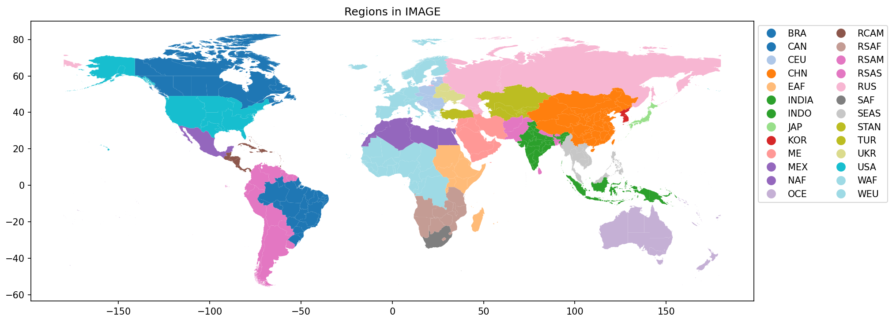
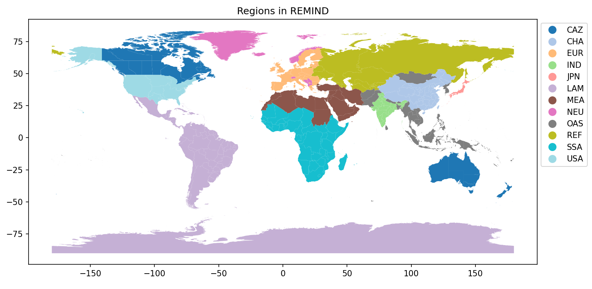

TRANSFORM
=========

A series of transformations are applied to the Life Cycle Inventory (LCI) database to align process performance
and technology market shares with the outputs from the Integrated Assessment Model (IAM) scenario.

Power generation
""""""""""""""""

Run

.. code-block:: python

    from premise import *
    import brightway2 as bw

    bw.projects.set_current("my_project)

    ndb = NewDatabase(
        scenarios=[
                {"model":"remind", "pathway":"SSP2-Base", "year":2028}
            ],
        source_db="ecoinvent 3.7 cutoff",
        source_version="3.7.1",
        key='xxxxxxxxxxxxxxxxxxxxxxxxx'
    )
    ndb.update_electricity()

Efficiency adjustment
+++++++++++++++++++++

The energy conversion efficiency of power plant datasets for specific technologies is adjusted
to align with the efficiency changes indicated by the IAM scenario.

Combustion-based powerplants
----------------------------

First, *premise* adjust the efficiency of coal- and lignite-fired
power plants on the basis of the excellent work done by Oberschelp_ et al. (2019),
to update some datasets in ecoinvent, which are, for some of them, several decades
old. More specifically, the data provides plant-specific efficiency
and emissions factors. We average them by country and fuel type to obtain
volume-weighted factors. The efficiency of the following datasets is updated:

* electricity production, hard coal
* electricity production, lignite
* heat and power co-generation, hard coal
* heat and power co-generation, lignite

The data from Oberschelp_ et al. (2019) also allows us to update emissions of
SO2, NOx, CH4, and PMs.

.. _Oberschelp: https://www.nature.com/articles/s41893-019-0221-6

Second, *premise* iterates through coal, lignite, natural gas, biogas, and wood-fired power plant datasets
in the LCI database to calculate their current efficiency (i.e., the ratio between the primary fuel
energy entering the process and the output energy produced, which is often 1 kWh).
If the IAM scenario anticipates a change in efficiency for these processes, the inputs of the
datasets are scaled up or down by the scaling factor to effectively reflect a change in
fuel input per kWh produced.

The origin of this scaling factor is the IAM scenario selected.

To calculate the old and new efficiency of the dataset, it is necessary to know
the net calorific content of the fuel. The table below shows the Lower Heating Value for
the different fuels used in combustion-based power plants.

 ================================================================== ===========================
  name of fuel                                                       LHV [MJ/kg, as received]
 ================================================================== ===========================
  hard coal                                                          26.7
  lignite                                                            11.2
  petroleum coke                                                     31.3
  wood pellet                                                        16.2
  wood chips                                                         18.9
  natural gas                                                        45
  gas, natural, in ground                                            45
  refinery gas                                                       50.3
  propane                                                            46.46
  heavy fuel oil                                                     38.5
  oil, crude, in ground                                              38.5
  light fuel oil                                                     42.6
  biogas                                                             22.73
  biomethane                                                         47.5
  waste                                                              14
  methane, fossil                                                    47.5
  methane, biogenic                                                  47.5
  methane, synthetic                                                 47.5
  diesel                                                             43
  gasoline                                                           42.6
  petrol, 5% ethanol                                                 41.7
  petrol, synthetic, hydrogen                                        42.6
  petrol, synthetic, coal                                            42.6
  diesel, synthetic, hydrogen                                        43
  diesel, synthetic, coal                                            43
  diesel, synthetic, wood                                            43
  diesel, synthetic, wood, with CCS                                  43
  diesel, synthetic, grass                                           43
  diesel, synthetic, grass, with CCS                                 43
  hydrogen, petroleum                                                120
  hydrogen, electrolysis                                             120
  hydrogen, biomass                                                  120
  hydrogen, biomass, with CCS                                        120
  hydrogen, coal                                                     120
  hydrogen, nat. gas                                                 120
  hydrogen, nat. gas, with CCS                                       120
  hydrogen, biogas                                                   120
  hydrogen, biogas, with CCS                                         120
  hydrogen                                                           120
  biodiesel, oil                                                     38
  biodiesel, oil, with CCS                                           38
  bioethanol, wood                                                   26.5
  bioethanol, wood, with CCS                                         26.5
  bioethanol, grass                                                  26.5
  bioethanol, grass, with CCS                                        26.5
  bioethanol, grain                                                  26.5
  bioethanol, grain, with CCS                                        26.5
  bioethanol, sugar                                                  26.5
  bioethanol, sugar, with CCS                                        26.5
  ethanol                                                            26.5
  methanol, wood                                                     19.9
  methanol, grass                                                    19.9
  methanol, wood, with CCS                                           19.9
  methanol, grass, with CCS                                          19.9
  liquified petroleum gas, natural                                   45.5
  liquified petroleum gas, synthetic                                 45.5
  uranium, enriched 3.8%, in fuel element for light water reactor    4199040
  nuclear fuel element, for boiling water reactor, uo2 3.8%          4147200
  nuclear fuel element, for boiling water reactor, uo2 4.0%          4147200
  nuclear fuel element, for pressure water reactor, uo2 3.8%         4579200
  nuclear fuel element, for pressure water reactor, uo2 4.0%         4579200
  nuclear fuel element, for pressure water reactor, uo2 4.2%         4579200
  uranium hexafluoride                                               709166
  enriched uranium, 4.2%                                             4579200
  mox fuel element                                                   4579200
  heat, from hard coal                                               1
  heat, from lignite                                                 1
  heat, from petroleum coke                                          1
  heat, from wood pellet                                             1
  heat, from natural gas, high pressure                              1
  heat, from natural gas, low pressure                               1
  heat, from heavy fuel oil                                          1
  heat, from light fuel oil                                          1
  heat, from biogas                                                  1
  heat, from waste                                                   1
  heat, from methane, fossil                                         1
  heat, from methane, biogenic                                       1
  heat, from diesel                                                  1
  heat, from gasoline                                                1
  heat, from bioethanol                                              1
  heat, from biodiesel                                               1
  heat, from liquified petroleum gas, natural                        1
  heat, from liquified petroleum gas, synthetic                      1
  bagasse, from sugarcane                                            15.4
  bagasse, from sweet sorghum                                        13.8
  sweet sorghum stem                                                 4.45
  cottonseed                                                         21.97
  flax husks                                                         21.5
  coconut husk                                                       20
  sugar beet pulp                                                    5.11
  cleft timber                                                       14.46
  rape meal                                                          31.1
  molasse, from sugar beet                                           16.65
  sugar beet                                                         4.1
  barkey grain                                                       19.49
  rye grain                                                          12
  sugarcane                                                          5.3
  palm date                                                          10.8
  whey                                                               1.28
  straw                                                              15.5
  grass                                                              17
  manure, liquid                                                     0.875
  manure, solid                                                      3.6
  kerosene, from petroleum                                           43
  kerosene, synthetic, from electrolysis, energy allocation          43
  kerosene, synthetic, from electrolysis, economic allocation        43
  kerosene, synthetic, from coal, energy allocation                  43
  kerosene, synthetic, from coal, economic allocation                43
  kerosene, synthetic, from natural gas, energy allocation           43
  kerosene, synthetic, from natural gas, economic allocation         43
  kerosene, synthetic, from biomethane, energy allocation            43
  kerosene, synthetic, from biomethane, economic allocation          43
  kerosene, synthetic, from biomass, energy allocation               43
  kerosene, synthetic, from biomass, economic allocation             43
 ================================================================== ===========================

Additionally, the biogenic and fossil CO2 emissions of the datasets are also
scaled up or down by the same factor, as they are proportional to the amount of fuel used.

Below is an example of a natural gas power plant with a current (2020) conversion efficiency
of 77%. If the IAM scenario indicates a scaling factor of 1.03 in 2030, this suggests
that the efficiency increases by 3% relative to the current level. As shown in the table below,
this would result in a new efficiency of 79%, where all inputs, as well as CO2
emissions outputs, are re-scaled by 1/1.03 (=0.97).

While non-CO2 emissions (e.g., CO) are reduced because of the reduction in fuel consumption,
the emission factor per energy unit remains the same (i.e., gCO/MJ natural gas)).
It can be re-scaled using the `update_emissions` function, which updates emission factors according
to GAINS projections.

 =================================================== =========== =========== =======
  electricity production, natura gas, conventional    before      after       unit
 =================================================== =========== =========== =======
  electricity production                              1           1           kWh
  natural gas                                         0.1040      0.1010      m3
  water                                               0.0200      0.0194      m3
  powerplant construction                             1.00E-08    9.71E-09    unit
  CO2, fossil                                         0.0059      0.0057      kg
  CO, fossil                                          5.87E-06    5.42E-03    kg
  fuel-to-electricity efficiency                      77%         79%         %
 =================================================== =========== =========== =======

*premise* has a couple of rules regarding projected *scaling factors*:

* *scaling factors* inferior to 1 beyond 2020 are not accepted and are treated as 1.
* *scaling factors* superior to 1 before 2020 are not accepted and are treated as 1.
* efficiency can only improve over time.

This is to prevent degrading the performance of a technology in the future, or
improving its performance in the past, relative to today.

.. note::

    You can check the efficiencies assumed in your scenarios by generating
    a scenario summary report, or a report of changes. They are automatically
    generated after each database export, but you can also generate them manually:

.. code-block:: python

    ndb.generate_scenario_report()
    ndb.generate_change_report()

Photovoltaics panels
--------------------

Photovoltaic panels are expected to improve over time. The following module efficiencies
are considered for the different types of PV panels:

 ====================== =========== ============ =========== ======= ====== =======
  % module efficiency    micro-Si    single-Si    multi-Si    CIGS    CIS    CdTe
 ====================== =========== ============ =========== ======= ====== =======
  2010                   10          15.1         14          11      11     10
  2020                   11.9        17.9         16.8        14      14     16.8
  2050                   12.5        26.7         24.4        23.4    23.4   21
 ====================== =========== ============ =========== ======= ====== =======

The sources for these efficiencies are given in the inventory file LCI_PV_:

.. _LCI_PV: https://github.com/polca/premise/blob/master/premise/data/additional_inventories/lci-PV.xlsx

Given a scenario year, *premise* iterates through the different PV panel installation
datasets to update their efficiency accordingly.
To do so, the required surface of panel (in m2) per kW of capacity is
adjusted down (or up, if the efficiency is lower than current).

To calculate the current efficiency of a PV installation, *premise* assumes a solar
irradiation of 1000 W/m2. Hence, the current efficiency is calculated as::

    current_eff [%] = installation_power [W]  / (panel_surface [m2] * 1000 [W/m2])

The *scaling factor* is calculated as::

    scaling_factor = current_eff / new_eff

The required surface of PV panel in the dataset is then adjusted like so::

    new_surface = current_surface * (1 / scaling_factor)

For scenario years beyond 2050, 2050 efficiency values are used.

The table below provides such an example where a 450 kWp flat-roof installation
sees its current (2020) module efficiency improving from 20% to 26% by 2050.
THe are of PV panel (and mounting system) has been multiplied by 1 / (0.26/0.20),
all other inputs remaining unchanged.

 =================================================================== ========= ======== =======
  450kWp flat roof installation                                       before    after    unit
 =================================================================== ========= ======== =======
  photovoltaic flat-roof installation, 450 kWp, single-SI, on roof    1         1        unit
  inverter production, 500 kW                                         1.5       1.5      unit
  photovoltaic mounting system, …                                     2300      1731     m2
  photovoltaic panel, single-SI                                       2500      1881     m2
  treatment, single-SI PV module                                      30000     30000    kg
  electricity, low voltage                                            25        25       kWh
  module efficiency                                                   20%       26%      %
 =================================================================== ========= ======== =======

Markets
+++++++

*premise* creates additional datasets that represent the average supply and
production pathway for a given commodity for a given scenario, year and region.

Such datasets are called *regional markets*. Hence, a regional market for high voltage
electricity contains the different technologies that supply electricity at high voltage
in a given IAM region, in proportion to their respective production volumes.

Regional biomass markets
------------------------

*premise* creates regional markets for biomass which is meant to be used as fuel
in biomass-fired powerplants. Originally in ecoinvent, the biomass being supplied
to biomass-fired powerplants is "purpose grown" biomass that originate forestry
activities (called "market for wood chips" in ecoinvent). While this type of biomass
is suitable for such purpose, it is considered a co-product of the forestry activity,
and bears a share of the environmental burden of the process it originates from (notably
the land footprint, emissions, potential use of chemicals, etc.).

However, not all the biomass projected to be used in IAM scenarios is "purpose grown".
In fact, significant shares are expected to originate from forestry residues. In such
cases, the environmental burden of the forestry activity is entirely allocated to the
determining product (e.g., timber), not to the residue, which comes "free of burden".

Hence, *premise* creates average regional markets for biomass, which represents the
average shares of "purpose grown" and "residual" biomass being fed to biomass-fired powerplants.

The following market is created for each IAM region:

 =================================== ==================
  market name                         location
 =================================== ==================
  market for biomass, used as fuel    all IAM regions
 =================================== ==================

inside of which, the shares of "purpose grown" and "residual" biomass
is represented by the following activities:

========================== ===================================== ======================================= ===========================
  name in premise            name in REMIND                         name in IMAGE                         name in LCI database
========================== ===================================== ======================================= ===========================
  biomass - purpose grown    SE|Electricity|Biomass|Energy Crops   Primary Energy|Biomass|Energy Crops    market for wood chips
  biomass - residual         SE|Electricity|Biomass|Residues       Primary Energy|Biomass|Residues        Supply of forest residue
========================== ===================================== ======================================= ===========================

The sum of those shares equal 1. The activity "Supply of forest residue" includes
the energy, transport and associated emissions to chip the residual biomass
and transport it to the powerplant, but no other forestry-related burden is included.

.. note::

    You can check the share of residual biomass used for power generation
    assumed in your scenarios by generating a scenario summary report.

.. code-block:: python

    ndb.generate_scenario_report()

Regional electricity markets
----------------------------

High voltage regional markets
_____________________________

*premise* creates high, medium and low-voltage electricity markets for each IAM region.
It starts by creating high-voltage markets and define the share of each supplying technology
by their respective production volumes in respect to the total volume produced.

High voltage supplying technologies are all technologies besides:

* residential (<=3kWp) photovoltaic power (low voltage)
* waste incineration co-generating powerplants (medium voltage)

Several datasets can qualify for a given technology, in a given IAM region.
To define to which extent a given dataset should be supplying in the market,
*premise* uses the current production volume of the dataset.

For example, if coal-fired powerplants are to supply 25% of the high voltage
electricity in the IAM region "Europe", *premise* fetches the production volumes
of all coal-fired powerplants which ecoinvent location is *included* in the
IAM region "Europe" (e.g., DE, PL, LT, etc.), and allocates to each of those
a supply share based on their respective production volume in respect to the
total production volume of coal-fired powerplants.

For example, the table below shows the contribution of biomass-fired CHP powerplants
in the regional high voltage electricity market for IMAGE's "WEU" region
(Western Europe). The biomass CHP technology represents 2.46% of the supply mix.
Biomass CHP datasets included in the region "WEU" are given a supply share
corresponding to their respective current production volumes.

 ============== =========================================== ==================== ================================== =====================
  energy type    Supplier name                               Supplier location    Contribution within energy type    Final contribution
 ============== =========================================== ==================== ================================== =====================
  Biomass CHP    heat and power co-generation, wood chips    FR                   3.80%                              0.09%
  Biomass CHP    heat and power co-generation, wood chips    AT                   2.87%                              0.07%
  Biomass CHP    heat and power co-generation, wood chips    NO                   0.06%                              0.00%
  Biomass CHP    heat and power co-generation, wood chips    FI                   7.65%                              0.19%
  Biomass CHP    heat and power co-generation, wood chips    SE                   9.04%                              0.22%
  Biomass CHP    heat and power co-generation, wood chips    IT                   8.27%                              0.20%
  Biomass CHP    heat and power co-generation, wood chips    BE                   4.59%                              0.11%
  Biomass CHP    heat and power co-generation, wood chips    DE                   12.53%                             0.31%
  Biomass CHP    heat and power co-generation, wood chips    LU                   0.05%                              0.00%
  Biomass CHP    heat and power co-generation, wood chips    DK                   6.60%                              0.16%
  Biomass CHP    heat and power co-generation, wood chips    GR                   0.01%                              0.00%
  Biomass CHP    heat and power co-generation, wood chips    CH                   1.81%                              0.04%
  Biomass CHP    heat and power co-generation, wood chips    ES                   5.10%                              0.13%
  Biomass CHP    heat and power co-generation, wood chips    PT                   1.34%                              0.03%
  Biomass CHP    heat and power co-generation, wood chips    IE                   0.77%                              0.02%
  Biomass CHP    heat and power co-generation, wood chips    NL                   2.32%                              0.06%
  Biomass CHP    heat and power co-generation, wood chips    GB                   33.18%                             0.81%
  _              _                                           Sum                  100.00%                            2.46%
 ============== =========================================== ==================== ================================== =====================

Transformation losses are added to the high-voltage market datasets.
Transformation losses are the result of weighting country-specific
high voltage losses (provided by ecoinvent) of countries included in the
IAM region with their respective current production volumes (also provided by
ecoinvent). This is not ideal as it supposes that future country-specific
production volumes will remain the same in respect to one another.

Storage
-------

If the IAM scenario requires the use of storage, *premise* adds a storage
dataset to the high voltage market. *premise* can add two types of storage:

* storage via a large-scale flow battery (electricity supply, high voltage, from vanadium-redox flow battery system)
* storage via the conversion of electricity to hydrogen and subsequent use in a gas turbine (electricity production, from hydrogen-fired one gigawatt gas turbine)

The electricity storage via battery incurs a 33% loss. It is operated by a 8.3 MWh vanadium redox-based flow battery,
with a lifetime of 20 years or 8176 cycle-lifes (i.e., 49,000 MWh).

The storage of electricity via hydrogen is done in two steps: first, the electricity is converted to hydrogen
via a 1MW PEM electrolyser, with an efficiency of 62%. The hydrogen is then stored in a geological cavity
and used in a gas turbine, with an efficiency of 51%. Accounting for leakages and losses, the
overall efficiency of the process is about 37% (i.e., 2.7 kWh necessary to deliver 1 kWh to the grid).

The efficiency of the H2-fed gas turbine is based on the parameters of Ozawa_ et al. (2019).

.. _Ozawa: https://doi.org/10.1016/j.ijhydene.2019.02.230

Medium voltage regional markets
_______________________________

The workflow is not too different from that of high voltage markets.
There are however only two possible providers of electricity in medium
voltage markets: the high voltage market, as well as waste incineration
powerplants.

High-to-medium transformation losses are added as an input of the medium voltage
market to itself. Distribution losses are modelled the same way as for
high voltage markets and are added to the input from high voltage market.

Low voltage regional markets
____________________________

Low voltage regional markets receive an input from the medium voltage
market, as well as from residential photovoltaic power.

Medium-to-low transformation losses are added as an input from the low voltage
market to itself. Distribution losses are modelled the same way as
for high and medium voltage markets, and are added to the input
from the medium voltage market.

The table below shows the example of a low voltage market for the IAM IMAGE
regional "WEU".

 ============================================================== ============== ================ =========== ==================================================
  supplier                                                       amount         unit             location    description
 ============================================================== ============== ================ =========== ==================================================
  market group for electricity, medium voltage                   1.023880481    kilowatt hour    WEU         input from medium voltage + distribution losses
  market group for electricity, low voltage                      0.025538286    kilowatt hour    WEU         transformation losses (2.55%)
  electricity production, photovoltaic, residential              0.00035691     kilowatt hour    DE
  electricity production, photovoltaic, residential              0.000143875    kilowatt hour    IT
  electricity production, photovoltaic, residential              9.38E-05       kilowatt hour    ES
  electricity production, photovoltaic, residential              9.03E-05       kilowatt hour    GB
  electricity production, photovoltaic, residential              7.82E-05       kilowatt hour    FR
  electricity production, photovoltaic, residential              6.80E-05       kilowatt hour    NL
  electricity production, photovoltaic, residential              3.76E-05       kilowatt hour    BE
  electricity production, photovoltaic, residential              2.16E-05       kilowatt hour    GR
  electricity production, photovoltaic, residential              2.08E-05       kilowatt hour    CH
  electricity production, photovoltaic, residential              1.48E-05       kilowatt hour    AT
  electricity production, photovoltaic, residential              9.44E-06       kilowatt hour    SE
  electricity production, photovoltaic, residential              8.66E-06       kilowatt hour    DK
  electricity production, photovoltaic, residential              6.83E-06       kilowatt hour    PT
  electricity production, photovoltaic, residential              2.60E-06       kilowatt hour    FI
  electricity production, photovoltaic, residential              1.30E-06       kilowatt hour    LU
  electricity production, photovoltaic, residential              1.01E-06       kilowatt hour    NO
  electricity production, photovoltaic, residential              2.40E-07       kilowatt hour    IE
  distribution network construction, electricity, low voltage    8.74E-08       kilometer        RoW
  market for sulfur hexafluoride, liquid                         2.99E-09       kilogram         RoW
  sulfur hexafluoride                                            2.99E-09       kilogram                     transformer emissions
 ============================================================== ============== ================ =========== ==================================================

.. note::

    You can check the electricity supply mixes assumed
    in your scenarios by generating a scenario summary report.

.. code-block:: python

    ndb.generate_scenario_report()

Long-term regional electricity markets
--------------------------------------

Long-term (i.e., 20, 40 and 60 years) regional markets are created
for modelling the lifetime-weighted burden associated to electricity supply
for systems that have a long lifetime (e.g., battery electric vehicles, buildings).

These long-term markets contain a period-weighted electricity supply
mix. For example, if the scenario year is 2030 and the period considered
is 20 years, the supply mix represents the supply mixes between 2030 and 2050,
with an equal weight given to each year.

The rest of the modelling is similar to that of regular regional electricity
markets described above.

Original market datasets
________________________

Market datasets originally present in the ecoinvent LCI database are cleared
from any inputs. Instead, an input from the newly created regional market
is added, depending on the location of the dataset.

The table below shows the example of the low voltage electricity market
for Great Britain, which now only includes an input from the "WEU"
regional market, which "includes" it in terms of geography.

 ============================================ =========== ================ ===========
  Output                                       _           _                _
 ============================================ =========== ================ ===========
  *producer*                                   *amount*    *unit*           *location*
  market for electricity, low voltage          1.00E+00    kilowatt hour    **GB**
  **Input**                                    _           _                _
  *supplier*                                   *amount*    *unit*           *location*
  market group for electricity, low voltage    1.00E+00    kilowatt hour    **WEU**
 ============================================ =========== ================ ===========

Relinking
_________

Once the new markets are created, *premise* re-links all electricity-consuming
activities to the new regional markets. The regional market it re-links to
depends on the location of the consumer.

Cement production
"""""""""""""""""

The modelling of future improvements in the cement sector is relatively
simple at the moment, and does not involve the emergence of new
technologies (e.g., electric kilns).

Dataset proxies
+++++++++++++++

*premise* duplicates clinker production datasets in ecoinvent (called
"clinker production") so as to create a proxy dataset for each IAM region.
The location of the proxy datasets used for a given IAM region is a location
included in the IAM region. If no valid dataset is found, *premise* resorts
to using a rest-of-the-world (RoW) dataset to represent the IAM region.

*premise* changes the location of these duplicated datasets and fill
in different fields, such as that of *production volume*.

Efficiency adjustment
+++++++++++++++++++++

*premise* then adjusts the thermal efficiency of the process.
It does so by calculating the technology-weighted energy requirements
per ton of clinker.
Based on GNR/IEA roadmap data, *premise* uses:

* the share of kiln technology for a given region today (2020):
    * wet,
    * dry,
    * dry with pre-heater,
    * and dry with pre-heater and pre-calciner

* the energy requirement for each of these technologies today (2020).

Once the energy required per ton clinker today (2020) is known, it is
multiplied by a *scaling factor* that represents a change in efficiency
between today and the scenario year.

.. note::

    You can check the efficiency gains assumed relative to 2020
    in your scenarios by generating a scenario summary report.

.. code-block:: python

    ndb.generate_scenario_report()

.. note::

    *premise* enforces a lower limit on the fuel consumption per ton of clinker.
    This limit is set to 2.8 GJ/t clinker and corresponds to the minimum
    theoretical fuel consumption with an moisture content of the raw materials,
    as considered in the 2018 IEA_ cement roadmap report. Hence, regardless of the
    scaling factor, the fuel consumption per ton of clinker will never be less than
    2.8 GJ/t.

.. _IEA: https://iea.blob.core.windows.net/assets/cbaa3da1-fd61-4c2a-8719-31538f59b54f/TechnologyRoadmapLowCarbonTransitionintheCementIndustry.pdf

Once the new energy input is determined, *premise* scales down the fuel,
and the fossil and biogenic CO2 emissions accordingly, based on the Lower Heating Value
and CO2 emission factors for these fuels.

Note that the change in CO2 emissions only concerns the share
that originates from the combustion of fuels. It does not
concern the calcination emissions due to the production of
calcium oxide (CaO) from calcium carbonate (CaCO3), which is set
at a fix emission rate of 525 kg CO2/t clinker.

Carbon Capture and Storage
++++++++++++++++++++++++++

If the IAM scenario indicates that a share of the CO2 emissions
for the cement sector in a given region and year is sequestered and stored,
*premise* adds CCS to the corresponding clinker production dataset.

The CCS dataset used to that effect is from Meunier_ et al., 2020.
The dataset described the capture of CO2 from a cement plant.
To that dataset, *premise* adds another dataset that models the storage
of the CO2 underground, from Volkart_ et al, 2013.

Besides electricity, the CCS process requires heat, water and others inputs
to regenerate the amine-based sorbent. We use two data points to approximate the heat
requirement: 3.66 MJ/kg CO2 captured in 2020, and 2.6 MJ/kg in 2050.
The first number is from Meunier_ et al., 2020, while the second number is described
as the best-performing pilot project today, according to the 2022 review of pilot
projects by the Global CCS Institute_. It is further assumed that the heat requirement
is fulfilled to an extent of 15% by the recovery of excess heat, as mentioned in
the 2018 IEA_ cement roadmap report.

.. _Meunier: https://www.sciencedirect.com/science/article/pii/S0960148119310304
.. _Volkart: https://doi.org/10.1016/j.ijggc.2013.03.003
.. _Institute: https://www.globalccsinstitute.com/wp-content/uploads/2022/05/State-of-the-Art-CCS-Technologies-2022.pdf

.. note::

    You can check the the carbon capture rate for cement production assumed
    in your scenarios by generating a scenario summary report.

.. code-block:: python

    ndb.generate_scenario_report()

Cement markets
++++++++++++++

Run

.. code-block:: python

    from premise import *
    import brightway2 as bw

    bw.projects.set_current("my_project)

    ndb = NewDatabase(
        scenarios=[
                {"model":"remind", "pathway":"SSP2-Base", "year":2028}
            ],
        source_db="ecoinvent 3.7 cutoff",
        source_version="3.7.1",
        key='xxxxxxxxxxxxxxxxxxxxxxxxx'
    )
    ndb.update_cement()

When clinker production datasets are created for each IAM region,
*premise* duplicates cement production datasets for each IAM region
as well. These cement production datasets link the newly created
clinker production dataset, corresponding to their IAM region.

Clinker-to-cement ratio
+++++++++++++++++++++++

Most cement datasets in ecoinvent have a determined composition in terms
of clinker vs. supplementary cementitious materials (e.g., fly ash, blast
furnace slag, limestone). The clinker-to-cement ratio cannot be altered
for these cements, as it would render their label incorrect, but also
the type of application they are meant to fulfill (e.g., precast, mortar,
foundations).

However, one dataset represents an "average" cement
with an "average" composition. This dataset is called
"market for cement, unspecified". This market dataset is composed
of several types of cements, each having a clinker-to-cement ratio.
*premise* alters the shares of each of these cement types with the
"market for cement, unspecified" dataset so that the
average clinker-to-cement ratio aligns with the GNR/IEA projections.

GNR/IEA projections in terms of clinker-to-cement ratio are shown in the
table below.

 ========================== ======= ======= ======= ======= ======= ======= ======= ======= ======= ======= ======= ======= ======= ======= ======= ======= ======= ======= ======= =======
  clinker-to-cement ratio    2005    2010    2015    2020    2025    2030    2035    2040    2045    2050    2055    2060    2065    2070    2075    2080    2085    2090    2095    2100
 ========================== ======= ======= ======= ======= ======= ======= ======= ======= ======= ======= ======= ======= ======= ======= ======= ======= ======= ======= ======= =======
  Canada                     81%     80%     79%     77%     76%     75%     74%     73%     71%     70%     69%     68%     66%     65%     64%     63%     62%     60%     59%     58%
  China                      58%     58%     58%     58%     58%     58%     58%     58%     58%     58%     58%     58%     58%     58%     58%     58%     58%     58%     58%     58%
  Europe                     73%     72%     71%     71%     70%     69%     68%     67%     67%     66%     65%     64%     64%     63%     62%     61%     60%     60%     59%     58%
  India                      71%     70%     70%     69%     68%     68%     67%     66%     66%     65%     64%     63%     63%     62%     61%     61%     60%     59%     59%     58%
  Japan                      80%     79%     78%     77%     75%     74%     73%     72%     71%     70%     68%     67%     66%     65%     64%     63%     61%     60%     59%     58%
  Latin America              70%     69%     69%     68%     67%     67%     66%     66%     65%     64%     64%     63%     62%     62%     61%     61%     60%     59%     59%     58%
  Middle East                81%     80%     79%     77%     76%     75%     74%     73%     71%     70%     69%     68%     66%     65%     64%     63%     62%     60%     59%     58%
  Norther Europe             81%     80%     79%     77%     76%     75%     74%     73%     71%     70%     69%     68%     66%     65%     64%     63%     62%     60%     59%     58%
  Other Asia                 80%     79%     78%     77%     75%     74%     73%     72%     71%     70%     68%     67%     66%     65%     64%     63%     61%     60%     59%     58%
  Russia                     80%     79%     78%     77%     75%     74%     73%     72%     71%     70%     68%     67%     66%     65%     64%     63%     61%     60%     59%     58%
  South Africa               77%     76%     75%     74%     73%     72%     71%     70%     69%     68%     67%     66%     65%     64%     63%     62%     61%     60%     59%     58%
  United States              82%     81%     79%     78%     77%     76%     74%     73%     72%     71%     69%     68%     67%     66%     64%     63%     62%     61%     59%     58%
 ========================== ======= ======= ======= ======= ======= ======= ======= ======= ======= ======= ======= ======= ======= ======= ======= ======= ======= ======= ======= =======

Original market datasets
________________________

Market datasets originally present in the ecoinvent LCI database are cleared
from any inputs. Instead, an input from the newly created regional market
is added, depending on the location of the dataset.

The table below shows the example of the clinker market
for South Africa, which now only includes an input from the "SAF"
regional market, which "includes" it in terms of geography.

 ============================================ =========== ================ ===========
  Output                                       _           _                _
 ============================================ =========== ================ ===========
  producer                                     amount      unit             location
  market for clinker                           1.00E+00    kilogram         **ZA**
  Input                                        _           _                _
  supplier                                     amount      unit             location
  market for clinker                           1.00E+00    kilogram         ***SAF**
 ============================================ =========== ================ ===========

Relinking
+++++++++

Once cement production and market datasets are created, *premise*
re-links cement-consuming activities to the new regional markets for
cement. The regional market it re-links to depends on the location
of the consumer.

Steel production
""""""""""""""""

Run

.. code-block:: python

    from premise import *
    import brightway2 as bw

    bw.projects.set_current("my_project)

    ndb = NewDatabase(
        scenarios=[
                {"model":"remind", "pathway":"SSP2-Base", "year":2028}
            ],
        source_db="ecoinvent 3.7 cutoff",
        source_version="3.7.1",
        key='xxxxxxxxxxxxxxxxxxxxxxxxx'
    )
    ndb.update_steel()

The modelling of future improvements in the steel sector is relatively
simple at the moment, and does not involve the emergence of new
technologies (e.g., hydrogen-based DRI, electro-winning).

Dataset proxies
+++++++++++++++

*premise* duplicates steel production datasets in ecoinvent for the
production of primary and secondary steel (called respectively
"steel production, converter" and "steel production, electric")
so as to create a proxy dataset for each IAM region.

The location of the proxy datasets used for a given IAM region is a location
included in the IAM region. If no valid dataset is found, *premise* resorts
to using a rest-of-the-world (RoW) dataset to represent the IAM region.

*premise* changes the location of these duplicated datasets and fill
in different fields, such as that of *production volume*.

Efficiency adjustment
+++++++++++++++++++++

Regarding primary steel production (using BO-BOF), *premise* adjusts
the inputs of fuels found in:

* the pig iron production datasets,
* the steel production datasets,

assuming an integrated steel mill unit, by multiplying these fuel
inputs by a *scaling factor* provided by the IAM scenario.

Typical fuel inputs for these process are natural gas, coal, coal-based coke.
Emissions of (fossil) CO2 are scaled accordingly.

Regarding the production of secondary steel (using EAF),
*premise* adjusts the input of electricity based on teh scaling factor
provided by the IAM scenario.

.. note::

    You can check the efficiency gains assumed relative to 2020
    for steel production in your scenarios by generating a scenario
    summary report.

.. code-block:: python

    ndb.generate_scenario_report()

.. warning::

    If your system of interest relies heavily on the provision
    of steel, you should probably consider modelling steel production
    based on primary data. ecoinvent datasets for steel production rely
    on a few data points, which are then further process transformed
    by *premise*. Therefore, there is a large modelling uncertainty.

Carbon Capture and Storage
++++++++++++++++++++++++++

If the IAM scenario indicates that a share of the CO2 emissions
from the steel sector in a given region and year is sequestered and stored,
*premise* adds a corresponding input from a CCS dataset.
The datatset used to that effect is from Meunier_ et al., 2020.
The dataset described the capture of CO2 from a cement plant, not a steel mill,
but it is assumed to be an acceptable approximation since the CO2 concentration
in teh flue gases should not be significantly different.

To that dataset, *premise* adds another dataset that models the storage
of the CO2 underground, from Volkart_ et al, 2013.

Besides electricity, the CCS process requires heat, water and others inputs
to regenerate the amine-based sorbent. We use two data points to approximate the heat
requirement: 3.66 MJ/kg CO2 captured in 2020, and 2.6 MJ/kg in 2050.
The first number is from Meunier_ et al., 2020, while the second number is described
as the best-performing pilot project today, according to the 2022 review of pilot
projects by the Global CCS Institute_. It is further assumed that the heat requirement
is fulfilled to an extent of 15% by the recovery of excess heat, as mentioned in
the 2018 IEA_ cement roadmap report, which is assumed to be also valid in the
case of a steel mill.

Steel markets
+++++++++++++

*premise* create a dataset "market for steel, low-alloyed" for each IAM region.
Within each dataset, the supply shares of primary and secondary steel
are adjusted to reflect the projections from the IAM scenario, for a given region
and year, based on the variables below.

 ==================== ====================================== ============================= ==============================
  name in premise      name in REMIND                          name in IMAGE                name in LCI database
 ==================== ====================================== ============================= ==============================
  steel - primary      Production|Industry|Steel|Primary      Production|Steel|Primary      steel production, converter
  steel - secondary    Production|Industry|Steel|Secondary    Production|Steel|Secondary    steel production, electric
 ==================== ====================================== ============================= ==============================

The table below shows an example of the market for India, where 66% of the steel comes
from an oxygen converter process (primary steel), while 34% comes from an electric arc
furnace process (secondary steel).

 ================================================================= ============ ================ ===========
  Output                                                            _            _                _
 ================================================================= ============ ================ ===========
  producer                                                          amount       unit             location
  market for steel, low-alloyed                                     1            kilogram         IND
  Input
  supplier                                                          amount       unit             location
  market group for transport, freight, inland waterways, barge      0.5          ton kilometer    GLO
  market group for transport, freight train                         0.35         ton kilometer    GLO
  market for transport, freight, sea, bulk carrier for dry goods    0.38         ton kilometer    GLO
  transport, freight, lorry, unspecified, regional delivery         0.12         ton kilometer    IND
  steel production, **converter**, low-alloyed                      0.66         kilogram         IND
  steel production, **electric**, low-alloyed                       0.34         kilogram         IND
 ================================================================= ============ ================ ===========

Original market datasets
________________________

Market datasets originally present in the ecoinvent LCI database are cleared
from any inputs. Instead, an input from the newly created regional market
is added, depending on the location of the dataset.

The table below shows the example of the clinker market
for South Africa, which now only includes an input from the "SAF"
regional market, which "includes" it in terms of geography.

 ============================================ =========== ================ ===========
  Output                                       _           _                _
 ============================================ =========== ================ ===========
  producer                                     amount      unit             location
  market for clinker                           1.00E+00    kilogram         **ZA**
  Input                                        _           _                _
  supplier                                     amount      unit             location
  market for clinker                           1.00E+00    kilogram         **SAF**
 ============================================ =========== ================ ===========

Relinking
+++++++++

Once steel production and market datasets are created, *premise*
re-links steel-consuming activities to the new regional markets for
steel. The regional market it re-links to depends on the location
of the consumer.

Transport
"""""""""

Run

.. code-block:: python

    from premise import *
    import brightway2 as bw

    bw.projects.set_current("my_project)

    ndb = NewDatabase(
        scenarios=[
                {"model":"remind", "pathway":"SSP2-Base", "year":2028}
            ],
        source_db="ecoinvent 3.7 cutoff",
        source_version="3.7.1",
        key='xxxxxxxxxxxxxxxxxxxxxxxxx'
    )
    ndb.update_two_wheelers()
    ndb.update_cars()
    ndb.update_trucks()
    ndb.update_buses()

*premise* imports inventories for transport activity operated by:

* two-wheelers
* passenger cars
* medium and heavy duty trucks
* buses

These inventories are available for the construction year of 2000
to 2050, by steps of 5 years, but *premise* only imports vehicles
with a construction year inferior or equal to the scenario year
(vehicle from 2050 will not be imported in a database for the
scenario year of 2030, but vehicles from 2020 will, as they are
necessary to build the fleet average vehicles).

Trucks
++++++

The following size classes of medium and heavy duty trucks are imported:

- 3.5t
- 7.5t
- 18t
- 26t
- 40t

These weights refer to the vehicle gross mass (the maximum weight the vehicle is
allowed to reach, fully loaded).

Each truck is available for a variety of powertrain types:

- fuel cell electric
- battery electric
- diesel hybrid
- plugin diesel hybrid
- diesel
- compressed gas

but also for different driving cycles, to which a range autonomy
of the vehicle is associated:

- urban delivery (required range autonomy of 150 km)
- regional delivery (required range autonomy of 400 km)
- long haul (required range autonomy of 800 km)

Those are driving cycles developed for the software VECTO_,
which have become standard in measuring the CO2 emissions of trucks.

.. _VECTO: https://ec.europa.eu/clima/eu-action/transport-emissions/road-transport-reducing-co2-emissions-vehicles/vehicle-energy-consumption-calculation-tool-vecto_en

The truck vehicle model is from Sacchi_ et al, 2021.

.. _Sacchi: https://pubs.acs.org/doi/abs/10.1021/acs.est.0c07773

.. note::

    Not all powertrain types are available for regional and long haul driving cycles.
    This is specifically the case for battery electric trucks, for which the mass
    and size prevent them from completing the cycle, or surpasses the vehicle gross weight.

.. warning::

    A consequence of replacing original truck datasets with those provided by *premise*
    may be a steep increase in CO2-eq. emissions, especially if the urban driving cycle
    is chosen. Overall, considering and size classes, diesel truck datasets from ecoinvent
    have lower fuel consumption and exhaust emissions.

Fleet average trucks
--------------------

REMIND and IMAGE provide fleet composition data, per scenario, region and year.

The fleet data is expressed in "vehicle-kilometer" performed by each
type of vehicle, in a given region and year.

*premise* uses the following loads to translate the transport
demand from "vehicle-kilometers" to "ton-kilometers", derived from TRACCS_:

.. _TRACCS: https://traccs.emisia.com/

 ============== ================= ==================== ============
  load [tons]    urban delivery    regional delivery    long haul
 ============== ================= ==================== ============
  3.5t           0.26              0.26                 0.8
  7.5t           0.52              0.52                 1.6
  18t            1.35              1.35                 4.1
  26t            2.05              2.05                 6.2
  32t            6.1               6.1                  9.1
  40t            6.1               6.1                  9.1
 ============== ================= ==================== ============

.. note::

    Loads from the TRACCS survey data are representative for EU-28 conditions.
    *premise* applies these loads to all IAM regions. Hence, there might be
    some inconsistency at this level.
    Also, these loads are much lower than those assumed in original ecoinvent
    truck datasets.

*premise* uses the fleet data to produce fleet average trucks for each
IAM region, and more specifically:

* a fleet average truck, all powertrains and size classes considered
* a fleet average truck, all powertrains considered, for a given size class

They appear in the LCI database as the following:

 ========================================================================================= =============================================================
  truck transport dataset name                                                              description
 ========================================================================================= =============================================================
  transport, freight, lorry, 3.5t gross weight, unspecified powertrain, long haul           fleet average, for 3.5t size class, long haul cycle
  transport, freight, lorry, 3.5t gross weight, unspecified powertrain, regional delivery   fleet average, for 3.5t size class, regional delivery cycle
  transport, freight, lorry, 3.5t gross weight, unspecified powertrain, urban delivery      fleet average, for 3.5t size class, urban delivery cycle
  transport, freight, lorry, 7.5t gross weight, unspecified powertrain, long haul           fleet average, for 7.5t size class, long haul cycle
  transport, freight, lorry, 7.5t gross weight, unspecified powertrain, regional delivery   fleet average, for 7.5t size class, regional delivery cycle
  transport, freight, lorry, 7.5t gross weight, unspecified powertrain, urban delivery      fleet average, for 7.5t size class, urban delivery cycle
  transport, freight, lorry, 18t gross weight, unspecified powertrain, long haul            fleet average, for 18t size class, long haul cycle
  transport, freight, lorry, 18t gross weight, unspecified powertrain, regional delivery    fleet average, for 18t size class, regional delivery cycle
  transport, freight, lorry, 18t gross weight, unspecified powertrain, urban delivery       fleet average, for 18t size class, urban delivery cycle
  transport, freight, lorry, 26t gross weight, unspecified powertrain, long haul            fleet average, for 26t size class, long haul cycle
  transport, freight, lorry, 26t gross weight, unspecified powertrain, regional delivery    fleet average, for 26t size class, regional delivery cycle
  transport, freight, lorry, 26t gross weight, unspecified powertrain, urban delivery       fleet average, for 26t size class, urban delivery cycle
  transport, freight, lorry, 40t gross weight, unspecified powertrain, long haul            fleet average, for 26t size class, long haul cycle
  transport, freight, lorry, 40t gross weight, unspecified powertrain, regional delivery    fleet average, for 26t size class, regional delivery cycle
  transport, freight, lorry, 40t gross weight, unspecified powertrain, urban delivery       fleet average, for 26t size class, urban delivery cycle
  transport, freight, lorry, unspecified, long haul                                         fleet average, all powertrain types, all size classes
  transport, freight, lorry, unspecified, regional delivery                                 fleet average, all powertrain types, all size classes
  transport, freight, lorry, unspecified, urban delivery                                    fleet average, all powertrain types, all size classes
 ========================================================================================= =============================================================

Relinking
---------

Regarding trucks, *premise* re-links truck transport-consuming activities
to the newly created fleet average truck datasets.

The following table shows the correspondence between the original
truck transport datasets and the new ones replacing them:

 ======================================================================== ======================================================================= =======================================================================
  Original dataset                                                         Replaced by (REMIND)                                                    Replaced by (IMAGE)
 ======================================================================== ======================================================================= =======================================================================
  transport, freight, lorry, unspecified                                    transport, freight, lorry, unspecified                                  transport, freight, lorry, unspecified
  transport, freight, lorry 16-32 metric ton                                transport, freight, lorry, 26t gross weight, unspecified powertrain     transport, freight, lorry, 26t gross weight, unspecified powertrain
  transport, freight, lorry 28 metric ton, fatty acid methyl ester 100%     transport, freight, lorry, 26t gross weight, unspecified powertrain     transport, freight, lorry, 26t gross weight, unspecified powertrain
  transport, freight, lorry 3.5-7.5 metric ton                              transport, freight, lorry, 3.5t gross weight, unspecified powertrain    transport, freight, lorry, 26t gross weight, unspecified powertrain
  transport, freight, lorry 7.5-16 metric ton                               transport, freight, lorry, 7.5t gross weight, unspecified powertrain    transport, freight, lorry, 26t gross weight, unspecified powertrain
  transport, freight, lorry >32 metric ton                                  transport, freight, lorry, 40t gross weight, unspecified powertrain     transport, freight, lorry, 40t gross weight, unspecified powertrain
  transport, freight, lorry with reefer, cooling                            transport, freight, lorry, unspecified                                  transport, freight, lorry, unspecified
  transport, freight, lorry with reefer, freezing                           transport, freight, lorry, unspecified                                  transport, freight, lorry, unspecified
  transport, freight, lorry with refrigeration machine, 3.5-7.5 ton         transport, freight, lorry, 3.5t gross weight, unspecified powertrain    transport, freight, lorry, 26t gross weight, unspecified powertrain
  transport, freight, lorry with refrigeration machine, 7.5-16 ton          transport, freight, lorry, 7.5t gross weight, unspecified powertrain    transport, freight, lorry, 26t gross weight, unspecified powertrain
  transport, freight, lorry with refrigeration machine, cooling             transport, freight, lorry, unspecified                                  transport, freight, lorry, unspecified
  transport, freight, lorry with refrigeration machine, freezing            transport, freight, lorry, unspecified                                  transport, freight, lorry, unspecified
 ======================================================================== ======================================================================= =======================================================================

Note that IMAGE fleet data only uses 26t and 40t trucks.

Additionally, *premise* iterates through each truck transport-consuming
activities to calculate the driving distance required. When the reference
unit of the dataset is 1 kilogram, the distance driven by truck can easily
be inferred. Indeed, for example, 0.56 tkm of truck transport for 1 kg of
flour indicates that the flour has been transported over 560 km.

On this basis, *premise* chooses one of the following
driving cycles:

- *regional delivery*, if the distance is inferior or equal to 450 km
- *long haul*, if the distance is superior to 450 km

Hence, in the following dataset for "market for steel, low-alloyed"
for the IAM region of India, *premise* chose the *regional delivery*
driving cycle since the kilogram of steel has been transported on
average over 120 km by truck. The truck used to transport that kilogram of steel
is a fleet average vehicle built upon the REMIND fleet data for the region
of India.

 ================================================================= ============ ================ ===========
  Output                                                            _            _                _
 ================================================================= ============ ================ ===========
  producer                                                          amount       unit             location
  market for steel, low-alloyed                                     1            kilogram         IND
  Input
  supplier                                                          amount       unit             location
  market group for transport, freight, inland waterways, barge      0.5          ton kilometer    GLO
  market group for transport, freight train                         0.35         ton kilometer    GLO
  market for transport, freight, sea, bulk carrier for dry goods    0.38         ton kilometer    GLO
  transport, freight, lorry, unspecified, **regional delivery**     0.12         ton kilometer    IND
  steel production, converter, low-alloyed                          0.66         kilogram         IND
  steel production, electric, low-alloyed                           0.34         kilogram         IND
 ================================================================= ============ ================ ===========

Direct Air Capture
""""""""""""""""""

Run

.. code-block:: python

    from premise import *
    import brightway2 as bw

    bw.projects.set_current("my_project)

    ndb = NewDatabase(
        scenarios=[
                {"model":"remind", "pathway":"SSP2-Base", "year":2028}
            ],
        source_db="ecoinvent 3.7 cutoff",
        source_version="3.7.1",
        key='xxxxxxxxxxxxxxxxxxxxxxxxx'
    )
    ndb.update_dac()

*premise* creates different region-specific Direct Air Capture (DAC)
datasets. If the cumulative DAC deployment is available from the IAM scenario, *premise* applies a learning rate on the input
of thermal and electrical energy as well as infrastructure
relative to 2020 (see SI of Qiu_ et al., 2022).

The learning indicates the percentage improvement applied
for every doubling of the cumulated deployment capacity,
relative to 2020.

The following table shows the learning rates applied for
DAC systems for energy inputs:

+--------------------------------------------------+-------------------+-------------------+
| Technology                                       | Solvent-based DAC | Sorbent-based DAC |
+==================================================+===================+===================+
| Learning rate                                    | 2.50%             | 2.50%             |
+--------------------------------------------------+-------------------+-------------------+
| Theoretical minimum (relative to initial value)  | 95%               | 95%               |
+--------------------------------------------------+-------------------+-------------------+

The following table shows the learning rates applied for
DAC systems for infrastructure inputs (materials, chemicals, system):

+-------------------------------------------------+-------------------+-------------------+
| Technology                                      | Solvent-based DAC | Sorbent-based DAC |
+=================================================+===================+===================+
| Learning rate                                   | 10.00%            | 15.00%            |
+--------------------------------------------------+-------------------+-------------------+
| Theoretical minimum (relative to initial value) | 44%               | 18%               |
+-------------------------------------------------+-------------------+-------------------+

A scaling factor is calculated from applying the above learning rates
to the cumulative DAC deployment in the IAM scenario. The scaling factor
is then applied to the input of thermal and electrical energy as well as
infrastructure relative to 2020.

.. _Qiu: https://doi.org/10.1038/s41467-022-31146-1

Fuels
"""""

Run

.. code-block:: python

    from premise import *
    import brightway2 as bw

    bw.projects.set_current("my_project)

    ndb = NewDatabase(
        scenarios=[
                {"model":"remind", "pathway":"SSP2-Base", "year":2028}
            ],
        source_db="ecoinvent 3.7 cutoff",
        source_version="3.7.1",
        key='xxxxxxxxxxxxxxxxxxxxxxxxx'
    )
    ndb.update_fuels()

*premise* create different region-specific fuel supply chains
and fuel markets, based on data from the IAM scenario.

Efficiency adjustment
+++++++++++++++++++++

Biofuels
________

The biomass-to-fuel efficiency ratio of bioethanol and biodiesel
production datasets is adjusted according to the IAM scenario projections.

Inputs to the biofuel production datasets are multiplied by a *scaling factor*
that represents the change in efficiency relative to today (2020).

Hydrogen
________

Several pathways for hydrogen production are modeled in *premise*:

- electrolysis
- steam methane reforming of natural gas
- steam methane reforming of biomethane
- gasification of coal
- gasification of woody biomass

The last four pathways are modeled with and without CCS.

Inventories for these pathways are available under:

* premise/data/additional_inventories/lci-hydrogen-electrolysis.xlsx
* premise/data/additional_inventories/lci-smr-atr-natgas.xlsx
* premise/data/additional_inventories/lci-smr-atr-biogas.xlsx
* premise/data/additional_inventories/lci-hydrogen-coal-gasification.xlsx
* premise/data/additional_inventories/lci-hydrogen-wood-gasification.xlsx

In case the IAM variable that relates to a given hydrogen pathway's
efficiency is not available, the process' efficiency is not modified,
with the exception of electrolysis, which is modified regardless.

A scaling factor is calculated for each pathway, which is the ratio
between the IAM variable value for the year in question
and the current efficiency value (i.e., in 2020). *premise*
uses this scaling factor to adjust the amount of feedstock
input to produce 1 kg of hydrogen (e.g., m3 of natural gas per kg hydrogen).

If the IAM variable that relates to the efficiency of
the electrolysis hydrogen process is not available,
*premise* adjusts the amount of electricity needed
to produce 1 kg of hydrogen by electrolysis, on the basis of the following
requirements, which are sourced from Bauer_ et al, 2022:

 ==================== ======= ======= =======
  kWh/kg H2, 25 bar    2010    2020    2050
 ==================== ======= ======= =======
  electricity          58      55      44
 ==================== ======= ======= =======

.. _Bauer: https://www.psi.ch/en/media/77703/download?attachment

Land use and land use change
++++++++++++++++++++++++++++

When building a database using IMAGE, land use and land use change emissions
are available. Upon the import of crops farming datasets, *premise* adjusts
the land occupation as well as CO2 emissions associated to land use and land
use change, respectively.

 =========================================================== ========= ==================== ===========
  Output                                                      _         _                    _
 =========================================================== ========= ==================== ===========
  producer                                                    amount    unit                 location
  Farming and supply of corn                                  1         kilogram             CEU
  Input
  supplier                                                    amount    unit                 location
  market for diesel, burned in agricultural machinery         0.142     megajoule            GLO
  petrol, unleaded, burned in machinery                       0.042     megajoule            GLO
  market for natural gas, burned in gas motor, for storage    0.091     megajoule            GLO
  market group for electricity, low voltage                   0.004     kilowatt hour        CEU
  Energy, gross calorific value, in biomass                   15.910    megajoule            _
  **Occupation, annual crop**                                 1.584     square meter-year    _
  Carbon dioxide, in air                                      1.476     kilogram             _
  **Carbon dioxide, from soil or biomass stock**              1.140     kilogram             _
 =========================================================== ========= ==================== ===========

The land use value is given from the IAM scenario in Ha/GJ of primary crop energy.
Hence, the land occupation per kg of crop farmed is calculated as::

    land_use = land_use [Ha/GJ] * 10000 [m2/Ha] / 1000 [MJ/GJ] * LHV [MJ/kg]

Regarding land use change CO2 emissions, the principle is similar. The variable
is expressed in kg CO2/GJ of primary crop energy. Hence, the land use change
CO2 emissions per kg of crop farmed are calculated as::

    land_use_co2 = land_use_co2 [kg CO2/GJ] / 1000 [MJ/GJ] * LHV [MJ/kg]

Regional supply chains
++++++++++++++++++++++

*premise* builds several supply chains for synthetic fuels, for each IAM
region. THe reason for this is that synthetic fuels can be produced from
a variety of hydrogen and CO2 sources. Additionally, hydrogen can be supplied
by different means of transport, and in different states.

Hydrogen
________

*premise* starts by building different supply chains for hydrogen by varying:

* the transport mode: truck, hydrogen pipeline, re-assigned CNG pipeline, ship,
* the distance: 500 km, 2000 km
* the state of the hydrogen: gaseous, liquid, liquid organic compound,
* the hydrogen production route: electrolysis, SMR, biomass gasifier (coal, woody biomass)

Hence, for each IAM region, the following supply chains for hydrogen are built:

- hydrogen supply, from electrolysis, by ship, as liquid, over 2000 km
- hydrogen supply, from gasification of biomass by heatpipe reformer, by H2 pipeline, as gaseous, over 500 km
- hydrogen supply, from ATR of nat. gas, by truck, as gaseous, over 500 km
- hydrogen supply, from gasification of biomass by heatpipe reformer, by truck, as liquid organic compound, over 500 km
- hydrogen supply, from SMR of nat. gas, with CCS, by truck, as liquid organic compound, over 500 km
- hydrogen supply, from SMR of nat. gas, with CCS, by ship, as liquid, over 2000 km
- hydrogen supply, from coal gasification, by CNG pipeline, as gaseous, over 500 km
- hydrogen supply, from SMR of nat. gas, by ship, as liquid, over 2000 km
- hydrogen supply, from coal gasification, by truck, as liquid, over 500 km
- hydrogen supply, from gasification of biomass by heatpipe reformer, by truck, as liquid, over 500 km
- hydrogen supply, from ATR of nat. gas, with CCS, by truck, as liquid organic compound, over 500 km
- hydrogen supply, from SMR of nat. gas, with CCS, by truck, as liquid, over 500 km
- hydrogen supply, from electrolysis, by truck, as liquid organic compound, over 500 km
- hydrogen supply, from gasification of biomass, by truck, as liquid organic compound, over 500 km
- hydrogen supply, from SMR of nat. gas, with CCS, by truck, as gaseous, over 500 km
- hydrogen supply, from SMR of biogas, with CCS, by CNG pipeline, as gaseous, over 500 km
- hydrogen supply, from SMR of nat. gas, by truck, as gaseous, over 500 km
- hydrogen supply, from SMR of nat. gas, by H2 pipeline, as gaseous, over 500 km
- hydrogen supply, from gasification of biomass, with CCS, by truck, as liquid organic compound, over 500 km
- hydrogen supply, from gasification of biomass, by ship, as liquid, over 2000 km

Each supply route is associated with specific losses.
Losses for the transport of H2 by truck and hydrogen pipelines, and losses
at the regional storage storage (salt cavern) are from Wulf_ et al, 2018.
Boil-off loss values during shipping are from Hank_ et al, 2020.
Losses when transporting H2 via re-assigned CNG pipelines are from Cerniauskas_ et al, 2020.
Losses along the pipeline are from Schori_ et al, 2012., but to be considered conservative, as those
are initially for natural gas (and hydrogen has a higher potential for leaking).

.. _Wulf: https://www.sciencedirect.com/science/article/pii/S095965261832170X
.. _Cerniauskas: https://doi.org/10.1016/j.ijhydene.2020.02.121
.. _Hank: https://pubs.rsc.org/en/content/articlelanding/2020/se/d0se00067a
.. _Schori: https://treeze.ch/fileadmin/user_upload/downloads/PublicLCI/Schori_2012_NaturalGas.pdf

 ========================== ================= ======== ======= ============== =============== ====================
  _                          _                 truck    ship    H2 pipeline    CNG pipeline    reference flow
 ========================== ================= ======== ======= ============== =============== ====================
  gaseous                    compression       0.5%             0.5%           0.5%            per kg H2
  _                          storage buffer                     2.3%           2.3%            per kg H2
  _                          storage leak                       1.0%           1.0%            per kg H2
  _                          pipeline leak                      0.004%         0.004%          per kg H2, per km
  _                          purification                                      7.0%            per kg H2
  liquid                     liquefaction      1.3%     1.3%                                   per kg H2
  _                          vaporization      2.0%     2.0%                                   per kg H2
  _                          boil-off          0.2%     0.2%                                   per kg H2, per day
  liquid organic compound    hydrogenation     0.5%                                            per kg H2
 ========================== ================= ======== ======= ============== =============== ====================

Losses are cumulative along the supply chain and range anywhere between 5 and 20%.
The table below shows the example of 1 kg of hydrogen transport via re-assigned CNG pipelines,
as a gas, over 500 km.
A total of 0.13 kg of hydrogen is lost along the supply chain (13% loss):

 =============================================================================== ============== ================ ===========
  Output                                                                          _              _                _
 =============================================================================== ============== ================ ===========
  producer                                                                        amount         unit             location
  hydrogen supply, from electrolysis, by CNG pipeline, as gaseous, over 500 km    1              kilogram         OCE
  Input
  supplier                                                                        amount         unit             location
  hydrogen production, gaseous, 25 bar, from electrolysis                         1.133          kilogram         OCE
  market group for electricity, low voltage                                       3.091          kilowatt hour    OCE
  market group for electricity, low voltage                                       0.516          kilowatt hour    OCE
  hydrogen embrittlement inhibition                                               1              kilogram         OCE
  geological hydrogen storage                                                     1              kilogram         OCE
  Hydrogen refuelling station                                                     1.14E-07       unit             OCE
  distribution pipeline for hydrogen, reassigned CNG pipeline                     1.56E-08       kilometer        RER
  transmission pipeline for hydrogen, reassigned CNG pipeline                     1.56E-08       kilometer        RER
 =============================================================================== ============== ================ ===========

- 7% during the purification of hydrogen: when using CNG pipelines, the hydrogen has to be
  mixed with another gas to prevent the embrittlement of the pipelines. The separation process
  at the other end leads to significant losses
- 2% lost along the 500 km of pipeline
- 3% at the regional storage (salt cavern)

Also, in this same case, electricity is used:

- 1.9 kWh to compress the H2 from 25 bar to 100 bar to inject it into the pipeline
- 1.2 kWh to recompress the H2 along the pipeline every 250 km
- 0.34 kWh for injecting and pumping H2 into a salt cavern
- 2.46 kWh to blend the H2 with oxygen on one end, and purify on the other
- 0.5 kWh to pre-cool the H2 at the fuelling station (necessary if used in fuel cells, for example)

Fuel markets
++++++++++++

*premise* builds markets for the following fuels:

- market for petrol, unleaded
- market for petrol, low-sulfur
- market for diesel, low-sulfur
- market for diesel
- market for natural gas, high pressure
- market for hydrogen, gaseous

based on the IAM scenario data regarding the composition of
liquid and gaseous secondary energy carriers:

 ==================================== =============================================== ========================================================================= ================================================================================================================================================
  name in premise                      name in REMIND                                   name in IMAGE                                                            name in LCI database
 ==================================== =============================================== ========================================================================= ================================================================================================================================================
  natural gas                          SE|Gases|Non-Biomass                                                                                                      natural gas, high pressure
  biomethane                           SE|Gases|Biomass                                                                                                          biomethane, gaseous
  diesel                               SE|Liquids|Oil                                  Secondary Energy|Consumption|Liquids|Fossil                               diesel production, low-sulfur
  gasoline                             SE|Liquids|Oil                                  Secondary Energy|Consumption|Liquids|Fossil                               petrol production, low-sulfur
  petrol, synthetic, hydrogen          SE|Liquids|Hydrogen                                                                                                       gasoline production, synthetic, from methanol, hydrogen from electrolysis, CO2 from DAC, energy allocation, at fuelling station
  petrol, synthetic, coal              SE|Liquids|Coal|w/o CCS                                                                                                   gasoline production, synthetic, from methanol, hydrogen from coal gasification, CO2 from DAC, energy allocation, at fuelling station
  diesel, synthetic, hydrogen          SE|Liquids|Hydrogen                                                                                                       diesel production, synthetic, from Fischer Tropsch process, hydrogen from electrolysis, energy allocation, at fuelling station
  diesel, synthetic, coal              SE|Liquids|Coal|w/o CCS                                                                                                   diesel production, synthetic, from Fischer Tropsch process, hydrogen from coal gasification, energy allocation, at fuelling station
  diesel, synthetic, wood              SE|Liquids|Biomass|Biofuel|BioFTR|w/o CCS       Secondary Energy|Consumption|Liquids|Biomass|FT Diesel|Woody|w/oCCS       diesel production, synthetic, from Fischer Tropsch process, hydrogen from wood gasification, energy allocation, at fuelling station
  diesel, synthetic, wood, with CCS    SE|Liquids|Biomass|Biofuel|BioFTRC|w/ CCS       Secondary Energy|Consumption|Liquids|Biomass|FT Diesel|Woody|w/CCS        diesel production, synthetic, from Fischer Tropsch process, hydrogen from wood gasification, with CCS, energy allocation, at fuelling station
  diesel, synthetic, grass                                                             Secondary Energy|Consumption|Liquids|Biomass|FT Diesel|Grassy|w/oCCS      diesel production, synthetic, from Fischer Tropsch process, hydrogen from wood gasification, energy allocation, at fuelling station
  diesel, synthetic, grass, with CCS                                                   Secondary Energy|Consumption|Liquids|Biomass|FT Diesel|Grassy|w/CCS       diesel production, synthetic, from Fischer Tropsch process, hydrogen from wood gasification, with CCS, energy allocation, at fuelling station
  hydrogen, electrolysis               SE|Hydrogen|Electricity                                                                                                   hydrogen supply, from electrolysis
  hydrogen, biomass                    SE|Hydrogen|Biomass|w/o CCS                                                                                               hydrogen supply, from gasification of biomass, by
  hydrogen, biomass, with CCS          SE|Hydrogen|Biomass|w/ CCS                                                                                                hydrogen supply, from gasification of biomass by heatpipe reformer, with CCS
  hydrogen, coal                       SE|Hydrogen|Coal|w/o CCS                                                                                                  hydrogen supply, from coal gasification, by truck, as gaseous, over 500 km
  hydrogen, nat. gas                   SE|Hydrogen|Gas|w/o CCS                                                                                                   hydrogen supply, from SMR of nat. gas, by truck, as gaseous, over 500 km
  hydrogen, nat. gas, with CCS         SE|Hydrogen|Gas|w/ CCS                                                                                                    hydrogen supply, from SMR of nat. gas, with CCS, by truck, as gaseous, over 500 km
  biodiesel, oil                       SE|Liquids|Biomass|Biofuel|Biodiesel|w/o CCS    Secondary Energy|Consumption|Liquids|Biomass|Biodiesel|Oilcrops|w/oCCS    biodiesel production, via transesterification
  biodiesel, oil, with CCS                                                             Secondary Energy|Consumption|Liquids|Biomass|Biodiesel|Oilcrops|w/CCS     biodiesel production, via transesterification
  bioethanol, wood                     SE|Liquids|Biomass|Cellulosic|w/o CCS           Secondary Energy|Consumption|Liquids|Biomass|Ethanol|Woody|w/oCCS         ethanol production, via fermentation, from forest
  bioethanol, wood, with CCS           SE|Liquids|Biomass|Cellulosic|w/ CCS            Secondary Energy|Consumption|Liquids|Biomass|Ethanol|Woody|w/CCS          ethanol production, via fermentation, from forest, with carbon capture and storage
  bioethanol, grass                    SE|Liquids|Biomass|Non-Cellulosic               Secondary Energy|Consumption|Liquids|Biomass|Ethanol|Grassy|w/oCCS        ethanol production, via fermentation, from switchgrass
  bioethanol, grass, with CCS                                                          Secondary Energy|Consumption|Liquids|Biomass|Ethanol|Grassy|w/CCS         ethanol production, via fermentation, from switchgrass, with carbon capture and storage
  bioethanol, grain                    SE|Liquids|Biomass|Conventional Ethanol         Secondary Energy|Consumption|Liquids|Biomass|Ethanol|Maize|w/oCCS         ethanol production, via fermentation, from wheat grains
  bioethanol, grain, with CCS                                                          Secondary Energy|Consumption|Liquids|Biomass|Ethanol|Maize|w/CCS          ethanol production, via fermentation, from corn, with carbon capture and storage
  bioethanol, sugar                    SE|Liquids|Biomass|Conventional Ethanol         Secondary Energy|Consumption|Liquids|Biomass|Ethanol|Sugar|w/oCCS         ethanol production, via fermentation, from sugarbeet
  bioethanol, sugar, with CCS                                                          Secondary Energy|Consumption|Liquids|Biomass|Ethanol|Sugar|w/CCS          ethanol production, via fermentation, from sugarbeet, with carbon capture and storage
  methanol, wood                                                                       Secondary Energy|Consumption|Liquids|Biomass|Methanol|Woody|w/oCCS        market for methanol, from biomass
  methanol, grass                                                                      Secondary Energy|Consumption|Liquids|Biomass|Methanol|Grassy|w/oCCS       market for methanol, from biomass
  methanol, wood, with CCS                                                             Secondary Energy|Consumption|Liquids|Biomass|Methanol|Woody|w/CCS         market for methanol, from biomass
  methanol, grass, with CCS                                                            Secondary Energy|Consumption|Liquids|Biomass|Methanol|Grassy|w/CCS        market for methanol, from biomass
 ==================================== =============================================== ========================================================================= ================================================================================================================================================

.. warning::

    Some fuel types are not properly represented in the LCI database. Available inventories for biomass-based methanol production do not differentiate
    between wood and grass as the feedstock.

.. note::

    **Modelling choice**: *premise* builds several potential supply chains for hydrogen.
    Because the logistics to supply hydrogen in the future is not known or indicated by the IAM,
    the choice is made to supply it by truck over 500 km, in a gaseous state.

Influence of differing LHV on fuel market composition
_____________________________________________________

Because not all competing fuels of a same type have similar calorific values,
some adjustments are made. The table below shows the example of the market for
gasoline, for the IMAGE region of Western Europe in 2050.
The sum of fuel inputs is superior to 1 (i.e., 1.4 kg).
This is because the market dataset as "1 kg" as reference unit, and
methanol and bioethanol have low
calorific values comparatively to petrol
(i.e., 19.9 and 26.5 MJ/kg respectively, vs. 42.6 MJ/kg for gasoline).
Hence, their inputs are scaled up to reach an average calorific value
of 42.6 MJ/kg of fuel supplied by the market.

This is necessary as gasoline-consuming activities in the lCI database
are modelled with the calorific value of conventional gasoline.

 =================================================================== ========= =========== ===========
  Output                                                              _         _           _
 =================================================================== ========= =========== ===========
  producer                                                            amount    unit        location
  market for petrol, low-sulfur                                       1         kilogram    WEU
  Input
  supplier                                                            amount    unit        location
  petrol production, low-sulfur                                       0.550     kilogram    CH
  market for methanol, from biomass                                   0.169     kilogram    CH
  market for methanol, from biomass                                   0.148     kilogram    CH
  market for methanol, from biomass                                   0.122     kilogram    CH
  market for methanol, from biomass                                   0.122     kilogram    CH
  Ethanol production, via fermentation, from switchgrass              0.060     kilogram    WEU
  Ethanol production, via fermentation, from switchgrass, with CCS    0.053     kilogram    WEU
  Ethanol production, via fermentation, from sugarbeet                0.051     kilogram    WEU
  Ethanol production, via fermentation, from sugarbeet, with CCS      0.051     kilogram    WEU
  Ethanol production, via fermentation, from poplar, with CCS         0.041     kilogram    WEU
  Ethanol production, via fermentation, from poplar                   0.041     kilogram    WEU
 =================================================================== ========= =========== ===========

CO2 emissions update
++++++++++++++++++++

*premise* iterates through activities that consume any of the newly created
fuel markets to update the way CO2 emissions are modelled. Based on the fuel
market composition, CO2 emissions within the fuel-consuming activity are
split between fossil and non-fossil emissions.

The table below shows the example where the CO2 emissions of a 3.5t truck
have been split into biogenic and fossil fractions after re-link to the
new diesel market of the REMIND region for India.

 ========================================== =========== ========== ================ ===========
  Output                                     before      after      _                _
 ========================================== =========== ========== ================ ===========
  producer                                   amount      amount     unit             location
  transport, freight, lorry, diesel, 3.5t    1           1          ton-kilometer    IND
  Input
  supplier                                   amount      amount     unit             location
  treatment of tyre wear emissions, lorry    -0.0009     -0.0009    kilogram         RER
  market for road maintenance                0.0049      0.0049     meter-year       RER
  market for road                            0.0041      0.0041     meter-year       GLO
  treatment of road wear emissions, lorry    -0.0008     -0.0008    kilogram         RER
  market for refrigerant R134a               2.84E-05    2.84E-05   kilogram         GLO
  treatment of brake wear emissions, lorry   -0.0005     -0.0005    kilogram         RER
  Light duty truck, diesel, 3.5t             1.39E-05    1.39E-05   unit             RER
  market for diesel, low-sulfur              0.1854      0.1854     kilogram         IND
  **Carbon dioxide, fossil**                 0.5840      0.5667     kilogram         _
  **Carbon dioxide, non-fossil**             0.0000      0.0173     kilogram         _
  Nitrogen oxides                            0.0008      0.0008     kilogram         _
  Nitrogen oxides                            0.0003      0.0003     kilogram         _
 ========================================== =========== ========== ================ ===========

Geographical mapping
""""""""""""""""""""

IAM models have slightly different geographical resolutions and definitions.

Map of IMAGE regions

Map of REMIND regions

*premise* uses the following correspondence between ecoinvent locations
and IAM regions. This mapping is performed by the constructive_geometries_
implementation in the wurst_ library.

.. _constructive_geometries: https://github.com/cmutel/constructive_geometries
.. _wurst: https://github.com/polca/wurst

 ========================================= ================ ===============
  ecoinvent location                        REMIND region    IMAGE region
 ========================================= ================ ===============
  AE                                        MEA              ME
  AL                                        NEU              CEU
  AM                                        REF              RUS
  AO                                        SSA              RSAF
  APAC                                      OAS              SEAS
  AR                                        LAM              RSAM
  AT                                        EUR              WEU
  AU                                        CAZ              OCE
  AZ                                        REF              RUS
  BA                                        NEU              CEU
  BD                                        OAS              RSAS
  BE                                        EUR              WEU
  BG                                        EUR              CEU
  BH                                        MEA              ME
  BJ                                        SSA              WAF
  BN                                        OAS              SEAS
  BO                                        LAM              RSAM
  BR                                        LAM              BRA
  BR-AC                                     LAM              BRA
  BR-AL                                     LAM              BRA
  BR-AM                                     LAM              BRA
  BR-AP                                     LAM              BRA
  BR-BA                                     LAM              BRA
  BR-CE                                     LAM              BRA
  BR-DF                                     LAM              BRA
  BR-ES                                     LAM              BRA
  BR-GO                                     LAM              BRA
  BR-MA                                     LAM              BRA
  BR-MG                                     LAM              BRA
  BR-Mid-western grid                       LAM              BRA
  BR-MS                                     LAM              BRA
  BR-MT                                     LAM              BRA
  BR-North-eastern grid                     LAM              BRA
  BR-Northern grid                          LAM              BRA
  BR-PA                                     LAM              BRA
  BR-PB                                     LAM              BRA
  BR-PE                                     LAM              BRA
  BR-PI                                     LAM              BRA
  BR-PR                                     LAM              BRA
  BR-RJ                                     LAM              BRA
  BR-RN                                     LAM              BRA
  BR-RO                                     LAM              BRA
  BR-RR                                     LAM              BRA
  BR-RS                                     LAM              BRA
  BR-SC                                     LAM              BRA
  BR-SE                                     LAM              BRA
  BR-South-eastern grid                     LAM              BRA
  BR-Southern grid                          LAM              BRA
  BR-SP                                     LAM              BRA
  BR-TO                                     LAM              BRA
  BW                                        SSA              RSAF
  BY                                        REF              UKR
  CA                                        CAZ              CAN
  CA-AB                                     CAZ              CAN
  CA-BC                                     CAZ              CAN
  CA-MB                                     CAZ              CAN
  Canada without Quebec                     CAZ              CAN
  CA-NB                                     CAZ              CAN
  CA-NF                                     CAZ              CAN
  CA-NS                                     CAZ              CAN
  CA-NT                                     CAZ              CAN
  CA-NU                                     CAZ              CAN
  CA-ON                                     CAZ              CAN
  CA-PE                                     CAZ              CAN
  CA-QC                                     CAZ              CAN
  CA-SK                                     CAZ              CAN
  CA-YK                                     CAZ              CAN
  CD                                        SSA              WAF
  CENTREL                                   EUR              CEU
  CG                                        SSA              WAF
  CH                                        NEU              WEU
  CI                                        SSA              WAF
  CL                                        LAM              RSAM
  CM                                        SSA              WAF
  CN                                        CHA              CHN
  CN-AH                                     CHA              CHN
  CN-BJ                                     CHA              CHN
  CN-CQ                                     CHA              CHN
  CN-CSG                                    CHA              CHN
  CN-FJ                                     CHA              CHN
  CN-GD                                     CHA              CHN
  CN-GS                                     CHA              CHN
  CN-GX                                     CHA              CHN
  CN-GZ                                     CHA              CHN
  CN-HA                                     CHA              CHN
  CN-HB                                     CHA              CHN
  CN-HE                                     CHA              CHN
  CN-HL                                     CHA              CHN
  CN-HN                                     CHA              CHN
  CN-HU                                     CHA              CHN
  CN-JL                                     CHA              CHN
  CN-JS                                     CHA              CHN
  CN-JX                                     CHA              CHN
  CN-LN                                     CHA              CHN
  CN-NM                                     CHA              CHN
  CN-NX                                     CHA              CHN
  CN-QH                                     CHA              CHN
  CN-SA                                     CHA              CHN
  CN-SC                                     CHA              CHN
  CN-SD                                     CHA              CHN
  CN-SGCC                                   CHA              CHN
  CN-SH                                     CHA              CHN
  CN-SX                                     CHA              CHN
  CN-TJ                                     CHA              CHN
  CN-XJ                                     CHA              CHN
  CN-XZ                                     CHA              CHN
  CN-YN                                     CHA              CHN
  CN-ZJ                                     CHA              CHN
  CO                                        LAM              RSAM
  CR                                        LAM              RCAM
  CU                                        LAM              RCAM
  CW                                        LAM              RCAM
  CY                                        EUR              CEU
  CZ                                        EUR              CEU
  DE                                        EUR              WEU
  DK                                        EUR              WEU
  DO                                        LAM              RCAM
  DZ                                        MEA              NAF
  EC                                        LAM              RSAM
  EE                                        EUR              CEU
  EG                                        MEA              NAF
  ENTSO-E                                   EUR              WEU
  ER                                        SSA              EAF
  ES                                        EUR              WEU
  ET                                        SSA              EAF
  Europe without Austria                    EUR              WEU
  Europe without Switzerland                EUR              WEU
  Europe without Switzerland and Austria    EUR              WEU
  Europe, without Russia and Turkey         EUR              WEU
  FI                                        EUR              WEU
  FR                                        EUR              WEU
  GA                                        SSA              WAF
  GB                                        EUR              WEU
  GE                                        REF              RUS
  GH                                        SSA              WAF
  GI                                        EUR              WEU
  GLO                                       World            World
  GR                                        EUR              WEU
  GT                                        LAM              RCAM
  HK                                        CHA              CHN
  HN                                        LAM              RCAM
  HR                                        EUR              CEU
  HT                                        LAM              RCAM
  HU                                        EUR              CEU
  IAI Area, Africa                          SSA              RSAF
  IAI Area, Asia, without China and GCC     OAS              SEAS
  IAI Area, EU27 & EFTA                     EUR              WEU
  IAI Area, Gulf Cooperation Council        MEA              ME
  IAI Area, North America                   USA              USA
  IAI Area, Russia & RER w/o EU27 & EFTA    REF              RUS
  IAI Area, South America                   LAM              RSAM
  ID                                        OAS              INDO
  IE                                        EUR              WEU
  IL                                        MEA              ME
  IN                                        IND              INDIA
  IN-AP                                     IND              INDIA
  IN-AR                                     IND              INDIA
  IN-AS                                     IND              INDIA
  IN-BR                                     IND              INDIA
  IN-CT                                     IND              INDIA
  IN-DL                                     IND              INDIA
  IN-Eastern grid                           IND              INDIA
  IN-GA                                     IND              INDIA
  IN-GJ                                     IND              INDIA
  IN-HP                                     IND              INDIA
  IN-HR                                     IND              INDIA
  IN-JH                                     IND              INDIA
  IN-JK                                     IND              INDIA
  IN-KA                                     IND              INDIA
  IN-KL                                     IND              INDIA
  IN-MH                                     IND              INDIA
  IN-ML                                     IND              INDIA
  IN-MN                                     IND              INDIA
  IN-MP                                     IND              INDIA
  IN-NL                                     IND              INDIA
  IN-North-eastern grid                     IND              INDIA
  IN-Northern grid                          IND              INDIA
  IN-OR                                     IND              INDIA
  IN-PB                                     IND              INDIA
  IN-PY                                     IND              INDIA
  IN-RJ                                     IND              INDIA
  IN-SK                                     IND              INDIA
  IN-Southern grid                          IND              INDIA
  IN-TN                                     IND              INDIA
  IN-TR                                     IND              INDIA
  IN-UP                                     IND              INDIA
  IN-UT                                     IND              INDIA
  IN-WB                                     IND              INDIA
  IN-Western grid                           IND              INDIA
  IQ                                        MEA              ME
  IR                                        MEA              ME
  IS                                        NEU              WEU
  IT                                        EUR              WEU
  JM                                        LAM              RCAM
  JO                                        MEA              ME
  JP                                        JPN              JAP
  KE                                        SSA              EAF
  KG                                        REF              STAN
  KH                                        OAS              SEAS
  KP                                        OAS              KOR
  KR                                        OAS              KOR
  KW                                        MEA              ME
  KZ                                        REF              STAN
  LB                                        MEA              ME
  LK                                        OAS              RSAS
  LT                                        EUR              CEU
  LU                                        EUR              WEU
  LV                                        EUR              CEU
  LY                                        MEA              NAF
  MA                                        MEA              NAF
  MD                                        REF              UKR
  ME                                        NEU              ME
  MG                                        SSA              EAF
  MK                                        NEU              CEU
  MM                                        OAS              SEAS
  MN                                        OAS              CHN
  MT                                        EUR              WEU
  MU                                        SSA              EAF
  MX                                        LAM              MEX
  MY                                        OAS              SEAS
  MZ                                        SSA              RSAF
  NA                                        SSA              RSAF
  NE                                        SSA              WAF
  NG                                        SSA              WAF
  NI                                        LAM              RCAM
  NL                                        EUR              WEU
  NO                                        NEU              WEU
  NORDEL                                    NEU              WEU
  North America without Quebec              USA              USA
  NP                                        OAS              RSAS
  NZ                                        CAZ              OCE
  OCE                                       CAZ              OCE
  OM                                        MEA              ME
  PA                                        LAM              RCAM
  PE                                        LAM              RSAM
  PG                                        OAS              INDO
  PH                                        OAS              SEAS
  PK                                        OAS              RSAS
  PL                                        EUR              CEU
  PT                                        EUR              WEU
  PY                                        LAM              RSAM
  QA                                        MEA              ME
  RAF                                       SSA              RSAF
  RAS                                       CHA              CHN
  RER                                       EUR              WEU
  RER w/o CH+DE                             EUR              WEU
  RER w/o DE+NL+RU                          EUR              WEU
  RER w/o RU                                EUR              WEU
  RLA                                       LAM              RSAM
  RME                                       MEA              ME
  RNA                                       USA              USA
  RO                                        EUR              CEU
  RoW                                       World            World
  RS                                        NEU              CEU
  RU                                        REF              RUS
  RW                                        SSA              EAF
  SA                                        MEA              ME
  SAS                                       IND              INDIA
  SD                                        MEA              EAF
  SE                                        EUR              WEU
  SG                                        OAS              SEAS
  SI                                        EUR              CEU
  SK                                        EUR              CEU
  SN                                        SSA              WAF
  SS                                        SSA              EAF
  SV                                        LAM              RCAM
  SY                                        MEA              ME
  TG                                        SSA              WAF
  TH                                        OAS              SEAS
  TJ                                        REF              STAN
  TM                                        REF              STAN
  TN                                        MEA              NAF
  TR                                        MEA              TUR
  TT                                        LAM              RCAM
  TW                                        CHA              CHN
  TZ                                        SSA              RSAF
  UA                                        REF              UKR
  UCTE                                      EUR              WEU
  UCTE without Germany                      EUR              WEU
  UN-OCEANIA                                CAZ              OCE
  UN-SEASIA                                 OAS              SEAS
  US                                        USA              USA
  US-ASCC                                   USA              USA
  US-HICC                                   USA              USA
  US-MRO                                    USA              USA
  US-NPCC                                   USA              USA
  US-PR                                     USA              USA
  US-RFC                                    USA              USA
  US-SERC                                   USA              USA
  US-TRE                                    USA              USA
  US-WECC                                   USA              USA
  UY                                        LAM              RSAM
  UZ                                        REF              STAN
  VE                                        LAM              RSAM
  VN                                        OAS              SEAS
  WECC                                      USA              USA
  WEU                                       EUR              WEU
  XK                                        EUR              CEU
  YE                                        MEA              ME
  ZA                                        SSA              SAF
  ZM                                        SSA              RSAF
  ZW                                        SSA              RSAF
 ========================================= ================ ===============

Regionalization
"""""""""""""""

Several of the integration steps described above involve the
regionalization of datasets. It is the case, for example, when introducing
datasets representing a process for each of the IAM regions.
In such case, the datasets are regionalized by selecting the most
representative suppliers of inputs for each region. If a dataset
in a specific IAM region requires tap water, for example, the regionalization process will
select the most representative water suppliers in that region.

If more than one supplier is available, the regionalization process will
allocated a supply share to each candidate supplier based on their
respective production volume. If no adequate supplier is found for a given region,
the regionalization process will select all the existing suppliers and
allocate a supply share to each supplier based on their respective
production volume.

GAINS emission factors
""""""""""""""""""""""

When using `update_emissions()`, emission factors from the GAINS-EU_ and GAINS-IAM_ models are used to scale
non-CO2 emissions in various datasets.

.. _GAINS-EU: https://gains.iiasa.ac.at/gains/EUN/index.login
.. _GAINS-IAM: https://gains.iiasa.ac.at/gains/IAM/index.login

The emission factors are available under
https://github.com/polca/premise/tree/master/premise/data/GAINS_emission_factors

Emission factors from GAINS-EU are applied to activities in European countries.
Emission factors from GAINS-IAM are applied to activities in non-European countries,
or to European activities if an emission facor from GAINS-EU has not been
applied first.

Emission factors are specific to:

* an activity type,
* a year,
* a country (for GAINS-EU, otherwise a region),
* a fuel type,
* a technology type,
* and a scenario.

The mapping between GAINS and ecoinvent activities is available under the following file:
https://github.com/polca/premise/blob/master/premise/data/GAINS_emission_factors/gains_ecoinvent_sectoral_mapping.yaml

The table below shows the mapping between ecoinvent and GAINS emission flows.

+-------------------------------------------------------------------+----------------+
| ecoinvent species                                                 | GAINS species  |
+===================================================================+================+
| Sulfur dioxide                                                    |  SO2           |
+-------------------------------------------------------------------+----------------+
| Sulfur oxides                                                     |  SO2           |
+-------------------------------------------------------------------+----------------+
| Carbon monoxide, fossil                                           |  CO            |
+-------------------------------------------------------------------+----------------+
| Carbon monoxide, non-fossil                                       |  CO            |
+-------------------------------------------------------------------+----------------+
| Carbon monoxide, from soil or biomass stock                       |  CO            |
+-------------------------------------------------------------------+----------------+
| Nitrogen oxides                                                   |  NOx           |
+-------------------------------------------------------------------+----------------+
| Ammonia                                                           |  NH3           |
+-------------------------------------------------------------------+----------------+
| NMVOC, non-methane volatile organic compounds, unspecified origin |  VOC           |
+-------------------------------------------------------------------+----------------+
| VOC, volatile organic compounds, unspecified origin               |  VOC           |
+-------------------------------------------------------------------+----------------+
| Methane                                                           |  CH4           |
+-------------------------------------------------------------------+----------------+
| Methane, fossil                                                   |  CH4           |
+-------------------------------------------------------------------+----------------+
| Methane, non-fossil                                               |  CH4           |
+-------------------------------------------------------------------+----------------+
| Methane, from soil or biomass stock                               |  CH4           |
+-------------------------------------------------------------------+----------------+
| Dinitrogen monoxide                                               |  N2O           |
+-------------------------------------------------------------------+----------------+
| Particulates, > 10 um                                             |  PM10          |
+-------------------------------------------------------------------+----------------+
| Particulates, > 2.5 um, and < 10um                                |  PM25          |
+-------------------------------------------------------------------+----------------+
| Particulates, < 2.5 um                                            |  PM1           |
+-------------------------------------------------------------------+----------------+

We consider emission factors in ecoinvent as representative of the current situation.
Hence, we calculate a scaling factor from the GAINS emission factors for the year of
the scenario relative to the year 2020.

Two GAINS-IAM scenarios are available:

* **CLE**: **C**urrent **LE**gislation scenario
* **MFR**: **M**aximum **F**easible **R**eduction scenario

By default, the CLE scenario is used. To use the MFR scenario:

.. code-block:: python

    ndb = NewDatabase(
        ...
        gains_scenario="MFR",
    )

Finally, unlike GAINS-EU, GAINS-IAM uses IAM-like regions, not countries.
The mapping between IAM regions and GAINS-IAM regions is available under the following file:

https://github.com/polca/premise/blob/master/premise/iam_variables_mapping/gains_regions_mapping.yaml

For questions related to GAINS modelling, please contact the respective GAINS team:

* GAINS-EU: https://gains.iiasa.ac.at/gains/EUN/index.login
* GAINS-IAM: https://gains.iiasa.ac.at/gains/IAM/index.login

Logs
""""

*premise* generates a spreadsheet report detailing changes made to the database
for each scenario. The report is saved in the current working directory and
is automatically generated after database export.

The report lists the datasets added, updated and emptied.
It also gives a number of indicators relating to efficiency,
emissions, etc. for each scenario.

This report can also be generated manually using the `generate_change_report()` method.
